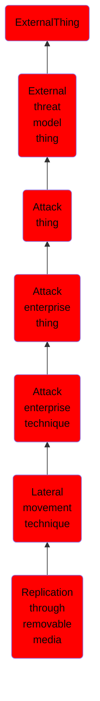

# Replication through removable media

## Overview

### Definition
Adversaries may move onto systems, possibly those on disconnected or air-gapped networks, by copying malware to removable media and taking advantage of Autorun features when the media is inserted into a system and executes. In the case of Lateral Movement, this may occur through modification of executable files stored on removable media or by copying malware and renaming it to look like a legitimate file to trick users into executing it on a separate system. In the case of Initial Access, this may occur through manual manipulation of the media, modification of systems used to initially format the media, or modification to the media's firmware itself.

### Examples
Not defined.

### Aliases
Not defined.

### URI
http://d3fend.mitre.org/ontologies/d3fend.owl#T1091

### Subclass Of

- [ExternalThing](/docs/ontology/reference/model/ExternalThing/ExternalThing.md)
- [External threat model thing](/docs/ontology/reference/model/ExternalThing/External%20threat%20model%20thing/External%20threat%20model%20thing.md)
- [Attack thing](/docs/ontology/reference/model/ExternalThing/External%20threat%20model%20thing/Attack%20thing/Attack%20thing.md)
- [Attack enterprise thing](/docs/ontology/reference/model/ExternalThing/External%20threat%20model%20thing/Attack%20thing/Attack%20enterprise%20thing/Attack%20enterprise%20thing.md)
- [Attack enterprise technique](/docs/ontology/reference/model/ExternalThing/External%20threat%20model%20thing/Attack%20thing/Attack%20enterprise%20thing/Attack%20enterprise%20technique/Attack%20enterprise%20technique.md)
- [Lateral movement technique](/docs/ontology/reference/model/ExternalThing/External%20threat%20model%20thing/Attack%20thing/Attack%20enterprise%20thing/Attack%20enterprise%20technique/Lateral%20movement%20technique/Lateral%20movement%20technique.md)
- [Replication through removable media](/docs/ontology/reference/model/ExternalThing/External%20threat%20model%20thing/Attack%20thing/Attack%20enterprise%20thing/Attack%20enterprise%20technique/Lateral%20movement%20technique/Replication%20through%20removable%20media/Replication%20through%20removable%20media.md)

### Ontology Reference
- [d3fend](http://d3fend.mitre.org/ontologies/d3fend.owl#)

## Properties
