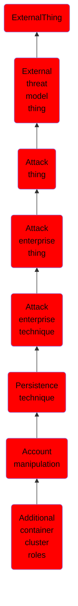

# Additional container cluster roles

## Overview

### Definition
An adversary may add additional roles or permissions to an adversary-controlled user or service account to maintain persistent access to a container orchestration system. For example, an adversary with sufficient permissions may create a RoleBinding or a ClusterRoleBinding to bind a Role or ClusterRole to a Kubernetes account.(Citation: Kubernetes RBAC)(Citation: Aquasec Kubernetes Attack 2023) Where attribute-based access control (ABAC) is in use, an adversary with sufficient permissions may modify a Kubernetes ABAC policy to give the target account additional permissions.(Citation: Kuberentes ABAC)

### Examples
Not defined.

### Aliases
Not defined.

### URI
http://d3fend.mitre.org/ontologies/d3fend.owl#T1098.006

### Subclass Of

- [ExternalThing](/docs/ontology/reference/model/ExternalThing/ExternalThing.md)
- [External threat model thing](/docs/ontology/reference/model/ExternalThing/External%20threat%20model%20thing/External%20threat%20model%20thing.md)
- [Attack thing](/docs/ontology/reference/model/ExternalThing/External%20threat%20model%20thing/Attack%20thing/Attack%20thing.md)
- [Attack enterprise thing](/docs/ontology/reference/model/ExternalThing/External%20threat%20model%20thing/Attack%20thing/Attack%20enterprise%20thing/Attack%20enterprise%20thing.md)
- [Attack enterprise technique](/docs/ontology/reference/model/ExternalThing/External%20threat%20model%20thing/Attack%20thing/Attack%20enterprise%20thing/Attack%20enterprise%20technique/Attack%20enterprise%20technique.md)
- [Persistence technique](/docs/ontology/reference/model/ExternalThing/External%20threat%20model%20thing/Attack%20thing/Attack%20enterprise%20thing/Attack%20enterprise%20technique/Persistence%20technique/Persistence%20technique.md)
- [Account manipulation](/docs/ontology/reference/model/ExternalThing/External%20threat%20model%20thing/Attack%20thing/Attack%20enterprise%20thing/Attack%20enterprise%20technique/Persistence%20technique/Account%20manipulation/Account%20manipulation.md)
- [Additional container cluster roles](/docs/ontology/reference/model/ExternalThing/External%20threat%20model%20thing/Attack%20thing/Attack%20enterprise%20thing/Attack%20enterprise%20technique/Persistence%20technique/Account%20manipulation/Additional%20container%20cluster%20roles/Additional%20container%20cluster%20roles.md)

### Ontology Reference
- [d3fend](http://d3fend.mitre.org/ontologies/d3fend.owl#)

## Properties
