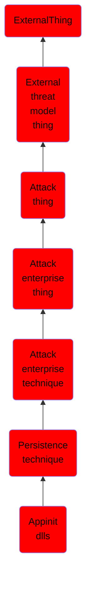

# Appinit dlls

## Overview

### Definition
Dynamic-link libraries (DLLs) that are specified in the AppInit_DLLs value in the Registry keys <code>HKEY_LOCAL_MACHINE\Software\Microsoft\Windows NT\CurrentVersion\Windows</code> or <code>HKEY_LOCAL_MACHINE\Software\Wow6432Node\Microsoft\Windows NT\CurrentVersion\Windows</code> are loaded by user32.dll into every process that loads user32.dll. In practice this is nearly every program, since user32.dll is a very common library. (Citation: Elastic Process Injection July 2017) Similar to [Process Injection](https://attack.mitre.org/techniques/T1055), these values can be abused to obtain persistence and privilege escalation by causing a malicious DLL to be loaded and run in the context of separate processes on the computer. (Citation: AppInit Registry)

### Examples
Not defined.

### Aliases
Not defined.

### URI
http://d3fend.mitre.org/ontologies/d3fend.owl#T1103

### Subclass Of

- [ExternalThing](/docs/ontology/reference/model/ExternalThing/ExternalThing.md)
- [External threat model thing](/docs/ontology/reference/model/ExternalThing/External%20threat%20model%20thing/External%20threat%20model%20thing.md)
- [Attack thing](/docs/ontology/reference/model/ExternalThing/External%20threat%20model%20thing/Attack%20thing/Attack%20thing.md)
- [Attack enterprise thing](/docs/ontology/reference/model/ExternalThing/External%20threat%20model%20thing/Attack%20thing/Attack%20enterprise%20thing/Attack%20enterprise%20thing.md)
- [Attack enterprise technique](/docs/ontology/reference/model/ExternalThing/External%20threat%20model%20thing/Attack%20thing/Attack%20enterprise%20thing/Attack%20enterprise%20technique/Attack%20enterprise%20technique.md)
- [Persistence technique](/docs/ontology/reference/model/ExternalThing/External%20threat%20model%20thing/Attack%20thing/Attack%20enterprise%20thing/Attack%20enterprise%20technique/Persistence%20technique/Persistence%20technique.md)
- [Appinit dlls](/docs/ontology/reference/model/ExternalThing/External%20threat%20model%20thing/Attack%20thing/Attack%20enterprise%20thing/Attack%20enterprise%20technique/Persistence%20technique/Appinit%20dlls/Appinit%20dlls.md)

### Ontology Reference
- [d3fend](http://d3fend.mitre.org/ontologies/d3fend.owl#)

## Properties
