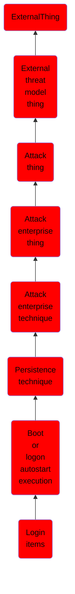

# Login items

## Overview

### Definition
Adversaries may add login items to execute upon user login to gain persistence or escalate privileges. Login items are applications, documents, folders, or server connections that are automatically launched when a user logs in.(Citation: Open Login Items Apple) Login items can be added via a shared file list or Service Management Framework.(Citation: Adding Login Items) Shared file list login items can be set using scripting languages such as [AppleScript](https://attack.mitre.org/techniques/T1059/002), whereas the Service Management Framework uses the API call <code>SMLoginItemSetEnabled</code>.

### Examples
Not defined.

### Aliases
Not defined.

### URI
http://d3fend.mitre.org/ontologies/d3fend.owl#T1547.015

### Subclass Of

- [ExternalThing](/docs/ontology/reference/model/ExternalThing/ExternalThing.md)
- [External threat model thing](/docs/ontology/reference/model/ExternalThing/External%20threat%20model%20thing/External%20threat%20model%20thing.md)
- [Attack thing](/docs/ontology/reference/model/ExternalThing/External%20threat%20model%20thing/Attack%20thing/Attack%20thing.md)
- [Attack enterprise thing](/docs/ontology/reference/model/ExternalThing/External%20threat%20model%20thing/Attack%20thing/Attack%20enterprise%20thing/Attack%20enterprise%20thing.md)
- [Attack enterprise technique](/docs/ontology/reference/model/ExternalThing/External%20threat%20model%20thing/Attack%20thing/Attack%20enterprise%20thing/Attack%20enterprise%20technique/Attack%20enterprise%20technique.md)
- [Persistence technique](/docs/ontology/reference/model/ExternalThing/External%20threat%20model%20thing/Attack%20thing/Attack%20enterprise%20thing/Attack%20enterprise%20technique/Persistence%20technique/Persistence%20technique.md)
- [Boot or logon autostart execution](/docs/ontology/reference/model/ExternalThing/External%20threat%20model%20thing/Attack%20thing/Attack%20enterprise%20thing/Attack%20enterprise%20technique/Persistence%20technique/Boot%20or%20logon%20autostart%20execution/Boot%20or%20logon%20autostart%20execution.md)
- [Login items](/docs/ontology/reference/model/ExternalThing/External%20threat%20model%20thing/Attack%20thing/Attack%20enterprise%20thing/Attack%20enterprise%20technique/Persistence%20technique/Boot%20or%20logon%20autostart%20execution/Login%20items/Login%20items.md)

### Ontology Reference
- [d3fend](http://d3fend.mitre.org/ontologies/d3fend.owl#)

## Properties
