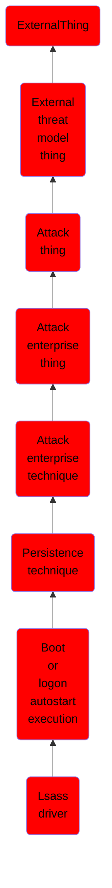

# Lsass driver

## Overview

### Definition
Adversaries may modify or add LSASS drivers to obtain persistence on compromised systems. The Windows security subsystem is a set of components that manage and enforce the security policy for a computer or domain. The Local Security Authority (LSA) is the main component responsible for local security policy and user authentication. The LSA includes multiple dynamic link libraries (DLLs) associated with various other security functions, all of which run in the context of the LSA Subsystem Service (LSASS) lsass.exe process.(Citation: Microsoft Security Subsystem)

### Examples
Not defined.

### Aliases
Not defined.

### URI
http://d3fend.mitre.org/ontologies/d3fend.owl#T1547.008

### Subclass Of

- [ExternalThing](/docs/ontology/reference/model/ExternalThing/ExternalThing.md)
- [External threat model thing](/docs/ontology/reference/model/ExternalThing/External%20threat%20model%20thing/External%20threat%20model%20thing.md)
- [Attack thing](/docs/ontology/reference/model/ExternalThing/External%20threat%20model%20thing/Attack%20thing/Attack%20thing.md)
- [Attack enterprise thing](/docs/ontology/reference/model/ExternalThing/External%20threat%20model%20thing/Attack%20thing/Attack%20enterprise%20thing/Attack%20enterprise%20thing.md)
- [Attack enterprise technique](/docs/ontology/reference/model/ExternalThing/External%20threat%20model%20thing/Attack%20thing/Attack%20enterprise%20thing/Attack%20enterprise%20technique/Attack%20enterprise%20technique.md)
- [Persistence technique](/docs/ontology/reference/model/ExternalThing/External%20threat%20model%20thing/Attack%20thing/Attack%20enterprise%20thing/Attack%20enterprise%20technique/Persistence%20technique/Persistence%20technique.md)
- [Boot or logon autostart execution](/docs/ontology/reference/model/ExternalThing/External%20threat%20model%20thing/Attack%20thing/Attack%20enterprise%20thing/Attack%20enterprise%20technique/Persistence%20technique/Boot%20or%20logon%20autostart%20execution/Boot%20or%20logon%20autostart%20execution.md)
- [Lsass driver](/docs/ontology/reference/model/ExternalThing/External%20threat%20model%20thing/Attack%20thing/Attack%20enterprise%20thing/Attack%20enterprise%20technique/Persistence%20technique/Boot%20or%20logon%20autostart%20execution/Lsass%20driver/Lsass%20driver.md)

### Ontology Reference
- [d3fend](http://d3fend.mitre.org/ontologies/d3fend.owl#)

## Properties
