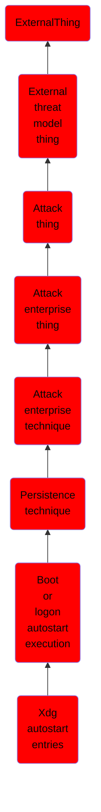

# Xdg autostart entries

## Overview

### Definition
Adversaries may add or modify XDG Autostart Entries to execute malicious programs or commands when a user’s desktop environment is loaded at login. XDG Autostart entries are available for any XDG-compliant Linux system. XDG Autostart entries use Desktop Entry files (`.desktop`) to configure the user’s desktop environment upon user login. These configuration files determine what applications launch upon user login, define associated applications to open specific file types, and define applications used to open removable media.(Citation: Free Desktop Application Autostart Feb 2006)(Citation: Free Desktop Entry Keys)

### Examples
Not defined.

### Aliases
Not defined.

### URI
http://d3fend.mitre.org/ontologies/d3fend.owl#T1547.013

### Subclass Of

- [ExternalThing](/docs/ontology/reference/model/ExternalThing/ExternalThing.md)
- [External threat model thing](/docs/ontology/reference/model/ExternalThing/External%20threat%20model%20thing/External%20threat%20model%20thing.md)
- [Attack thing](/docs/ontology/reference/model/ExternalThing/External%20threat%20model%20thing/Attack%20thing/Attack%20thing.md)
- [Attack enterprise thing](/docs/ontology/reference/model/ExternalThing/External%20threat%20model%20thing/Attack%20thing/Attack%20enterprise%20thing/Attack%20enterprise%20thing.md)
- [Attack enterprise technique](/docs/ontology/reference/model/ExternalThing/External%20threat%20model%20thing/Attack%20thing/Attack%20enterprise%20thing/Attack%20enterprise%20technique/Attack%20enterprise%20technique.md)
- [Persistence technique](/docs/ontology/reference/model/ExternalThing/External%20threat%20model%20thing/Attack%20thing/Attack%20enterprise%20thing/Attack%20enterprise%20technique/Persistence%20technique/Persistence%20technique.md)
- [Boot or logon autostart execution](/docs/ontology/reference/model/ExternalThing/External%20threat%20model%20thing/Attack%20thing/Attack%20enterprise%20thing/Attack%20enterprise%20technique/Persistence%20technique/Boot%20or%20logon%20autostart%20execution/Boot%20or%20logon%20autostart%20execution.md)
- [Xdg autostart entries](/docs/ontology/reference/model/ExternalThing/External%20threat%20model%20thing/Attack%20thing/Attack%20enterprise%20thing/Attack%20enterprise%20technique/Persistence%20technique/Boot%20or%20logon%20autostart%20execution/Xdg%20autostart%20entries/Xdg%20autostart%20entries.md)

### Ontology Reference
- [d3fend](http://d3fend.mitre.org/ontologies/d3fend.owl#)

## Properties
