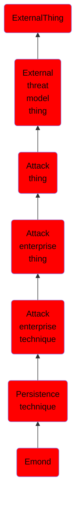

# Emond

## Overview

### Definition
Adversaries may use Event Monitor Daemon (emond) to establish persistence by scheduling malicious commands to run on predictable event triggers. Emond is a [Launch Daemon](https://attack.mitre.org/techniques/T1160) that accepts events from various services, runs them through a simple rules engine, and takes action. The emond binary at <code>/sbin/emond</code> will load any rules from the <code>/etc/emond.d/rules/</code> directory and take action once an explicitly defined event takes place. The rule files are in the plist format and define the name, event type, and action to take. Some examples of event types include system startup and user authentication. Examples of actions are to run a system command or send an email. The emond service will not launch if there is no file present in the QueueDirectories path <code>/private/var/db/emondClients</code>, specified in the [Launch Daemon](https://attack.mitre.org/techniques/T1160) configuration file at<code>/System/Library/LaunchDaemons/com.apple.emond.plist</code>.(Citation: xorrior emond Jan 2018)(Citation: magnusviri emond Apr 2016)(Citation: sentinelone macos persist Jun 2019)

### Examples
Not defined.

### Aliases
Not defined.

### URI
http://d3fend.mitre.org/ontologies/d3fend.owl#T1519

### Subclass Of

- [ExternalThing](/docs/ontology/reference/model/ExternalThing/ExternalThing.md)
- [External threat model thing](/docs/ontology/reference/model/ExternalThing/External%20threat%20model%20thing/External%20threat%20model%20thing.md)
- [Attack thing](/docs/ontology/reference/model/ExternalThing/External%20threat%20model%20thing/Attack%20thing/Attack%20thing.md)
- [Attack enterprise thing](/docs/ontology/reference/model/ExternalThing/External%20threat%20model%20thing/Attack%20thing/Attack%20enterprise%20thing/Attack%20enterprise%20thing.md)
- [Attack enterprise technique](/docs/ontology/reference/model/ExternalThing/External%20threat%20model%20thing/Attack%20thing/Attack%20enterprise%20thing/Attack%20enterprise%20technique/Attack%20enterprise%20technique.md)
- [Persistence technique](/docs/ontology/reference/model/ExternalThing/External%20threat%20model%20thing/Attack%20thing/Attack%20enterprise%20thing/Attack%20enterprise%20technique/Persistence%20technique/Persistence%20technique.md)
- [Emond](/docs/ontology/reference/model/ExternalThing/External%20threat%20model%20thing/Attack%20thing/Attack%20enterprise%20thing/Attack%20enterprise%20technique/Persistence%20technique/Emond/Emond.md)

### Ontology Reference
- [d3fend](http://d3fend.mitre.org/ontologies/d3fend.owl#)

## Properties
