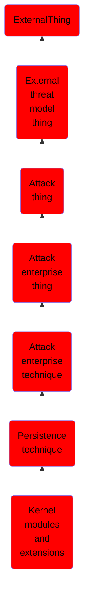

# Kernel modules and extensions

## Overview

### Definition
Loadable Kernel Modules (or LKMs) are pieces of code that can be loaded and unloaded into the kernel upon demand. They extend the functionality of the kernel without the need to reboot the system. For example, one type of module is the device driver, which allows the kernel to access hardware connected to the system. (Citation: Linux Kernel Programming) When used maliciously, Loadable Kernel Modules (LKMs) can be a type of kernel-mode [Rootkit](https://attack.mitre.org/techniques/T1014) that run with the highest operating system privilege (Ring 0). (Citation: Linux Kernel Module Programming Guide) Adversaries can use loadable kernel modules to covertly persist on a system and evade defenses. Examples have been found in the wild and there are some open source projects. (Citation: Volatility Phalanx2) (Citation: CrowdStrike Linux Rootkit) (Citation: GitHub Reptile) (Citation: GitHub Diamorphine)

### Examples
Not defined.

### Aliases
Not defined.

### URI
http://d3fend.mitre.org/ontologies/d3fend.owl#T1215

### Subclass Of

- [ExternalThing](/docs/ontology/reference/model/ExternalThing/ExternalThing.md)
- [External threat model thing](/docs/ontology/reference/model/ExternalThing/External%20threat%20model%20thing/External%20threat%20model%20thing.md)
- [Attack thing](/docs/ontology/reference/model/ExternalThing/External%20threat%20model%20thing/Attack%20thing/Attack%20thing.md)
- [Attack enterprise thing](/docs/ontology/reference/model/ExternalThing/External%20threat%20model%20thing/Attack%20thing/Attack%20enterprise%20thing/Attack%20enterprise%20thing.md)
- [Attack enterprise technique](/docs/ontology/reference/model/ExternalThing/External%20threat%20model%20thing/Attack%20thing/Attack%20enterprise%20thing/Attack%20enterprise%20technique/Attack%20enterprise%20technique.md)
- [Persistence technique](/docs/ontology/reference/model/ExternalThing/External%20threat%20model%20thing/Attack%20thing/Attack%20enterprise%20thing/Attack%20enterprise%20technique/Persistence%20technique/Persistence%20technique.md)
- [Kernel modules and extensions](/docs/ontology/reference/model/ExternalThing/External%20threat%20model%20thing/Attack%20thing/Attack%20enterprise%20thing/Attack%20enterprise%20technique/Persistence%20technique/Kernel%20modules%20and%20extensions/Kernel%20modules%20and%20extensions.md)

### Ontology Reference
- [d3fend](http://d3fend.mitre.org/ontologies/d3fend.owl#)

## Properties
