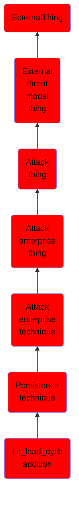

# Lc_load_dylib addition

## Overview

### Definition
Mach-O binaries have a series of headers that are used to perform certain operations when a binary is loaded. The LC_LOAD_DYLIB header in a Mach-O binary tells macOS and OS X which dynamic libraries (dylibs) to load during execution time. These can be added ad-hoc to the compiled binary as long adjustments are made to the rest of the fields and dependencies (Citation: Writing Bad Malware for OSX). There are tools available to perform these changes. Any changes will invalidate digital signatures on binaries because the binary is being modified. Adversaries can remediate this issue by simply removing the LC_CODE_SIGNATURE command from the binary so that the signature isn’t checked at load time (Citation: Malware Persistence on OS X).

### Examples
Not defined.

### Aliases
Not defined.

### URI
http://d3fend.mitre.org/ontologies/d3fend.owl#T1161

### Subclass Of

- [ExternalThing](/docs/ontology/reference/model/ExternalThing/ExternalThing.md)
- [External threat model thing](/docs/ontology/reference/model/ExternalThing/External%20threat%20model%20thing/External%20threat%20model%20thing.md)
- [Attack thing](/docs/ontology/reference/model/ExternalThing/External%20threat%20model%20thing/Attack%20thing/Attack%20thing.md)
- [Attack enterprise thing](/docs/ontology/reference/model/ExternalThing/External%20threat%20model%20thing/Attack%20thing/Attack%20enterprise%20thing/Attack%20enterprise%20thing.md)
- [Attack enterprise technique](/docs/ontology/reference/model/ExternalThing/External%20threat%20model%20thing/Attack%20thing/Attack%20enterprise%20thing/Attack%20enterprise%20technique/Attack%20enterprise%20technique.md)
- [Persistence technique](/docs/ontology/reference/model/ExternalThing/External%20threat%20model%20thing/Attack%20thing/Attack%20enterprise%20thing/Attack%20enterprise%20technique/Persistence%20technique/Persistence%20technique.md)
- [Lc_load_dylib addition](/docs/ontology/reference/model/ExternalThing/External%20threat%20model%20thing/Attack%20thing/Attack%20enterprise%20thing/Attack%20enterprise%20technique/Persistence%20technique/Lc_load_dylib%20addition/Lc_load_dylib%20addition.md)

### Ontology Reference
- [d3fend](http://d3fend.mitre.org/ontologies/d3fend.owl#)

## Properties
