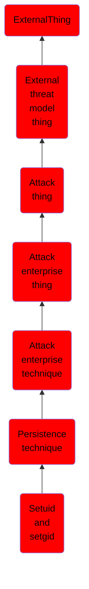

# Setuid and setgid

## Overview

### Definition
When the setuid or setgid bits are set on Linux or macOS for an application, this means that the application will run with the privileges of the owning user or group respectively  (Citation: setuid man page). Normally an application is run in the current user’s context, regardless of which user or group owns the application. There are instances where programs need to be executed in an elevated context to function properly, but the user running them doesn’t need the elevated privileges. Instead of creating an entry in the sudoers file, which must be done by root, any user can specify the setuid or setgid flag to be set for their own applications. These bits are indicated with an "s" instead of an "x" when viewing a file's attributes via <code>ls -l</code>. The <code>chmod</code> program can set these bits with via bitmasking, <code>chmod 4777 [file]</code> or via shorthand naming, <code>chmod u+s [file]</code>.

### Examples
Not defined.

### Aliases
Not defined.

### URI
http://d3fend.mitre.org/ontologies/d3fend.owl#T1166

### Subclass Of

- [ExternalThing](/docs/ontology/reference/model/ExternalThing/ExternalThing.md)
- [External threat model thing](/docs/ontology/reference/model/ExternalThing/External%20threat%20model%20thing/External%20threat%20model%20thing.md)
- [Attack thing](/docs/ontology/reference/model/ExternalThing/External%20threat%20model%20thing/Attack%20thing/Attack%20thing.md)
- [Attack enterprise thing](/docs/ontology/reference/model/ExternalThing/External%20threat%20model%20thing/Attack%20thing/Attack%20enterprise%20thing/Attack%20enterprise%20thing.md)
- [Attack enterprise technique](/docs/ontology/reference/model/ExternalThing/External%20threat%20model%20thing/Attack%20thing/Attack%20enterprise%20thing/Attack%20enterprise%20technique/Attack%20enterprise%20technique.md)
- [Persistence technique](/docs/ontology/reference/model/ExternalThing/External%20threat%20model%20thing/Attack%20thing/Attack%20enterprise%20thing/Attack%20enterprise%20technique/Persistence%20technique/Persistence%20technique.md)
- [Setuid and setgid](/docs/ontology/reference/model/ExternalThing/External%20threat%20model%20thing/Attack%20thing/Attack%20enterprise%20thing/Attack%20enterprise%20technique/Persistence%20technique/Setuid%20and%20setgid/Setuid%20and%20setgid.md)

### Ontology Reference
- [d3fend](http://d3fend.mitre.org/ontologies/d3fend.owl#)

## Properties
