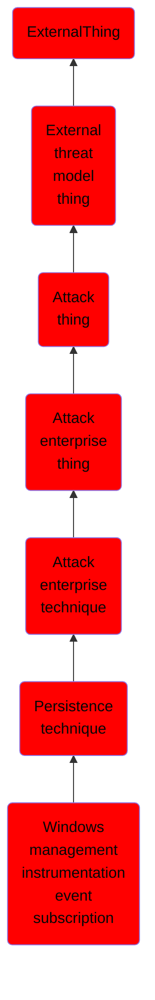

# Windows management instrumentation event subscription

## Overview

### Definition
Windows Management Instrumentation (WMI) can be used to install event filters, providers, consumers, and bindings that execute code when a defined event occurs. Adversaries may use the capabilities of WMI to subscribe to an event and execute arbitrary code when that event occurs, providing persistence on a system. Adversaries may attempt to evade detection of this technique by compiling WMI scripts into Windows Management Object (MOF) files (.mof extension). (Citation: Dell WMI Persistence) Examples of events that may be subscribed to are the wall clock time or the computer's uptime. (Citation: Kazanciyan 2014) Several threat groups have reportedly used this technique to maintain persistence. (Citation: Mandiant M-Trends 2015)

### Examples
Not defined.

### Aliases
Not defined.

### URI
http://d3fend.mitre.org/ontologies/d3fend.owl#T1084

### Subclass Of

- [ExternalThing](/docs/ontology/reference/model/ExternalThing/ExternalThing.md)
- [External threat model thing](/docs/ontology/reference/model/ExternalThing/External%20threat%20model%20thing/External%20threat%20model%20thing.md)
- [Attack thing](/docs/ontology/reference/model/ExternalThing/External%20threat%20model%20thing/Attack%20thing/Attack%20thing.md)
- [Attack enterprise thing](/docs/ontology/reference/model/ExternalThing/External%20threat%20model%20thing/Attack%20thing/Attack%20enterprise%20thing/Attack%20enterprise%20thing.md)
- [Attack enterprise technique](/docs/ontology/reference/model/ExternalThing/External%20threat%20model%20thing/Attack%20thing/Attack%20enterprise%20thing/Attack%20enterprise%20technique/Attack%20enterprise%20technique.md)
- [Persistence technique](/docs/ontology/reference/model/ExternalThing/External%20threat%20model%20thing/Attack%20thing/Attack%20enterprise%20thing/Attack%20enterprise%20technique/Persistence%20technique/Persistence%20technique.md)
- [Windows management instrumentation event subscription](/docs/ontology/reference/model/ExternalThing/External%20threat%20model%20thing/Attack%20thing/Attack%20enterprise%20thing/Attack%20enterprise%20technique/Persistence%20technique/Windows%20management%20instrumentation%20event%20subscription/Windows%20management%20instrumentation%20event%20subscription.md)

### Ontology Reference
- [d3fend](http://d3fend.mitre.org/ontologies/d3fend.owl#)

## Properties
