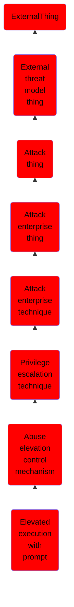

# Elevated execution with prompt

## Overview

### Definition
Adversaries may leverage the <code>AuthorizationExecuteWithPrivileges</code> API to escalate privileges by prompting the user for credentials.(Citation: AppleDocs AuthorizationExecuteWithPrivileges) The purpose of this API is to give application developers an easy way to perform operations with root privileges, such as for application installation or updating. This API does not validate that the program requesting root privileges comes from a reputable source or has been maliciously modified.

### Examples
Not defined.

### Aliases
Not defined.

### URI
http://d3fend.mitre.org/ontologies/d3fend.owl#T1548.004

### Subclass Of

- [ExternalThing](/docs/ontology/reference/model/ExternalThing/ExternalThing.md)
- [External threat model thing](/docs/ontology/reference/model/ExternalThing/External%20threat%20model%20thing/External%20threat%20model%20thing.md)
- [Attack thing](/docs/ontology/reference/model/ExternalThing/External%20threat%20model%20thing/Attack%20thing/Attack%20thing.md)
- [Attack enterprise thing](/docs/ontology/reference/model/ExternalThing/External%20threat%20model%20thing/Attack%20thing/Attack%20enterprise%20thing/Attack%20enterprise%20thing.md)
- [Attack enterprise technique](/docs/ontology/reference/model/ExternalThing/External%20threat%20model%20thing/Attack%20thing/Attack%20enterprise%20thing/Attack%20enterprise%20technique/Attack%20enterprise%20technique.md)
- [Privilege escalation technique](/docs/ontology/reference/model/ExternalThing/External%20threat%20model%20thing/Attack%20thing/Attack%20enterprise%20thing/Attack%20enterprise%20technique/Privilege%20escalation%20technique/Privilege%20escalation%20technique.md)
- [Abuse elevation control mechanism](/docs/ontology/reference/model/ExternalThing/External%20threat%20model%20thing/Attack%20thing/Attack%20enterprise%20thing/Attack%20enterprise%20technique/Privilege%20escalation%20technique/Abuse%20elevation%20control%20mechanism/Abuse%20elevation%20control%20mechanism.md)
- [Elevated execution with prompt](/docs/ontology/reference/model/ExternalThing/External%20threat%20model%20thing/Attack%20thing/Attack%20enterprise%20thing/Attack%20enterprise%20technique/Privilege%20escalation%20technique/Abuse%20elevation%20control%20mechanism/Elevated%20execution%20with%20prompt/Elevated%20execution%20with%20prompt.md)

### Ontology Reference
- [d3fend](http://d3fend.mitre.org/ontologies/d3fend.owl#)

## Properties
