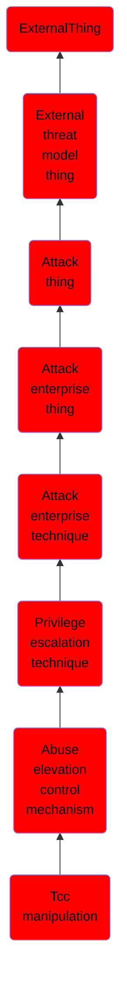

# Tcc manipulation

## Overview

### Definition
Adversaries can manipulate or abuse the Transparency, Consent, & Control (TCC) service or database to execute malicious applications with elevated permissions. TCC is a Privacy & Security macOS control mechanism used to determine if the running process has permission to access the data or services protected by TCC, such as screen sharing, camera, microphone, or Full Disk Access (FDA).

### Examples
Not defined.

### Aliases
Not defined.

### URI
http://d3fend.mitre.org/ontologies/d3fend.owl#T1548.006

### Subclass Of

- [ExternalThing](/docs/ontology/reference/model/ExternalThing/ExternalThing.md)
- [External threat model thing](/docs/ontology/reference/model/ExternalThing/External%20threat%20model%20thing/External%20threat%20model%20thing.md)
- [Attack thing](/docs/ontology/reference/model/ExternalThing/External%20threat%20model%20thing/Attack%20thing/Attack%20thing.md)
- [Attack enterprise thing](/docs/ontology/reference/model/ExternalThing/External%20threat%20model%20thing/Attack%20thing/Attack%20enterprise%20thing/Attack%20enterprise%20thing.md)
- [Attack enterprise technique](/docs/ontology/reference/model/ExternalThing/External%20threat%20model%20thing/Attack%20thing/Attack%20enterprise%20thing/Attack%20enterprise%20technique/Attack%20enterprise%20technique.md)
- [Privilege escalation technique](/docs/ontology/reference/model/ExternalThing/External%20threat%20model%20thing/Attack%20thing/Attack%20enterprise%20thing/Attack%20enterprise%20technique/Privilege%20escalation%20technique/Privilege%20escalation%20technique.md)
- [Abuse elevation control mechanism](/docs/ontology/reference/model/ExternalThing/External%20threat%20model%20thing/Attack%20thing/Attack%20enterprise%20thing/Attack%20enterprise%20technique/Privilege%20escalation%20technique/Abuse%20elevation%20control%20mechanism/Abuse%20elevation%20control%20mechanism.md)
- [Tcc manipulation](/docs/ontology/reference/model/ExternalThing/External%20threat%20model%20thing/Attack%20thing/Attack%20enterprise%20thing/Attack%20enterprise%20technique/Privilege%20escalation%20technique/Abuse%20elevation%20control%20mechanism/Tcc%20manipulation/Tcc%20manipulation.md)

### Ontology Reference
- [d3fend](http://d3fend.mitre.org/ontologies/d3fend.owl#)

## Properties
