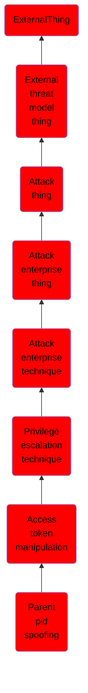

# Parent pid spoofing

## Overview

### Definition
Adversaries may spoof the parent process identifier (PPID) of a new process to evade process-monitoring defenses or to elevate privileges. New processes are typically spawned directly from their parent, or calling, process unless explicitly specified. One way of explicitly assigning the PPID of a new process is via the <code>CreateProcess</code> API call, which supports a parameter that defines the PPID to use.(Citation: DidierStevens SelectMyParent Nov 2009) This functionality is used by Windows features such as User Account Control (UAC) to correctly set the PPID after a requested elevated process is spawned by SYSTEM (typically via <code>svchost.exe</code> or <code>consent.exe</code>) rather than the current user context.(Citation: Microsoft UAC Nov 2018)

### Examples
Not defined.

### Aliases
Not defined.

### URI
http://d3fend.mitre.org/ontologies/d3fend.owl#T1134.004

### Subclass Of

- [ExternalThing](/docs/ontology/reference/model/ExternalThing/ExternalThing.md)
- [External threat model thing](/docs/ontology/reference/model/ExternalThing/External%20threat%20model%20thing/External%20threat%20model%20thing.md)
- [Attack thing](/docs/ontology/reference/model/ExternalThing/External%20threat%20model%20thing/Attack%20thing/Attack%20thing.md)
- [Attack enterprise thing](/docs/ontology/reference/model/ExternalThing/External%20threat%20model%20thing/Attack%20thing/Attack%20enterprise%20thing/Attack%20enterprise%20thing.md)
- [Attack enterprise technique](/docs/ontology/reference/model/ExternalThing/External%20threat%20model%20thing/Attack%20thing/Attack%20enterprise%20thing/Attack%20enterprise%20technique/Attack%20enterprise%20technique.md)
- [Privilege escalation technique](/docs/ontology/reference/model/ExternalThing/External%20threat%20model%20thing/Attack%20thing/Attack%20enterprise%20thing/Attack%20enterprise%20technique/Privilege%20escalation%20technique/Privilege%20escalation%20technique.md)
- [Access token manipulation](/docs/ontology/reference/model/ExternalThing/External%20threat%20model%20thing/Attack%20thing/Attack%20enterprise%20thing/Attack%20enterprise%20technique/Privilege%20escalation%20technique/Access%20token%20manipulation/Access%20token%20manipulation.md)
- [Parent pid spoofing](/docs/ontology/reference/model/ExternalThing/External%20threat%20model%20thing/Attack%20thing/Attack%20enterprise%20thing/Attack%20enterprise%20technique/Privilege%20escalation%20technique/Access%20token%20manipulation/Parent%20pid%20spoofing/Parent%20pid%20spoofing.md)

### Ontology Reference
- [d3fend](http://d3fend.mitre.org/ontologies/d3fend.owl#)

## Properties
