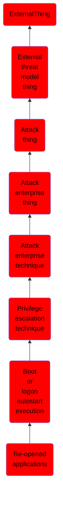

# Re-opened applications

## Overview

### Definition
Adversaries may modify plist files to automatically run an application when a user logs in. When a user logs out or restarts via the macOS Graphical User Interface (GUI), a prompt is provided to the user with a checkbox to "Reopen windows when logging back in".(Citation: Re-Open windows on Mac) When selected, all applications currently open are added to a property list file named <code>com.apple.loginwindow.[UUID].plist</code> within the <code>~/Library/Preferences/ByHost</code> directory.(Citation: Methods of Mac Malware Persistence)(Citation: Wardle Persistence Chapter) Applications listed in this file are automatically reopened upon the user’s next logon.

### Examples
Not defined.

### Aliases
Not defined.

### URI
http://d3fend.mitre.org/ontologies/d3fend.owl#T1547.007

### Subclass Of

- [ExternalThing](/docs/ontology/reference/model/ExternalThing/ExternalThing.md)
- [External threat model thing](/docs/ontology/reference/model/ExternalThing/External%20threat%20model%20thing/External%20threat%20model%20thing.md)
- [Attack thing](/docs/ontology/reference/model/ExternalThing/External%20threat%20model%20thing/Attack%20thing/Attack%20thing.md)
- [Attack enterprise thing](/docs/ontology/reference/model/ExternalThing/External%20threat%20model%20thing/Attack%20thing/Attack%20enterprise%20thing/Attack%20enterprise%20thing.md)
- [Attack enterprise technique](/docs/ontology/reference/model/ExternalThing/External%20threat%20model%20thing/Attack%20thing/Attack%20enterprise%20thing/Attack%20enterprise%20technique/Attack%20enterprise%20technique.md)
- [Privilege escalation technique](/docs/ontology/reference/model/ExternalThing/External%20threat%20model%20thing/Attack%20thing/Attack%20enterprise%20thing/Attack%20enterprise%20technique/Privilege%20escalation%20technique/Privilege%20escalation%20technique.md)
- [Boot or logon autostart execution](/docs/ontology/reference/model/ExternalThing/External%20threat%20model%20thing/Attack%20thing/Attack%20enterprise%20thing/Attack%20enterprise%20technique/Privilege%20escalation%20technique/Boot%20or%20logon%20autostart%20execution/Boot%20or%20logon%20autostart%20execution.md)
- [Re-opened applications](/docs/ontology/reference/model/ExternalThing/External%20threat%20model%20thing/Attack%20thing/Attack%20enterprise%20thing/Attack%20enterprise%20technique/Privilege%20escalation%20technique/Boot%20or%20logon%20autostart%20execution/Re-opened%20applications/Re-opened%20applications.md)

### Ontology Reference
- [d3fend](http://d3fend.mitre.org/ontologies/d3fend.owl#)

## Properties
