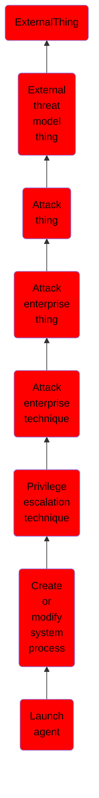

# Launch agent

## Overview

### Definition
Adversaries may create or modify launch agents to repeatedly execute malicious payloads as part of persistence. When a user logs in, a per-user launchd process is started which loads the parameters for each launch-on-demand user agent from the property list (.plist) file found in <code>/System/Library/LaunchAgents</code>, <code>/Library/LaunchAgents</code>, and <code>~/Library/LaunchAgents</code>.(Citation: AppleDocs Launch Agent Daemons)(Citation: OSX Keydnap malware) (Citation: Antiquated Mac Malware) Property list files use the <code>Label</code>, <code>ProgramArguments </code>, and <code>RunAtLoad</code> keys to identify the Launch Agent's name, executable location, and execution time.(Citation: OSX.Dok Malware) Launch Agents are often installed to perform updates to programs, launch user specified programs at login, or to conduct other developer tasks.

### Examples
Not defined.

### Aliases
Not defined.

### URI
http://d3fend.mitre.org/ontologies/d3fend.owl#T1543.001

### Subclass Of

- [ExternalThing](/docs/ontology/reference/model/ExternalThing/ExternalThing.md)
- [External threat model thing](/docs/ontology/reference/model/ExternalThing/External%20threat%20model%20thing/External%20threat%20model%20thing.md)
- [Attack thing](/docs/ontology/reference/model/ExternalThing/External%20threat%20model%20thing/Attack%20thing/Attack%20thing.md)
- [Attack enterprise thing](/docs/ontology/reference/model/ExternalThing/External%20threat%20model%20thing/Attack%20thing/Attack%20enterprise%20thing/Attack%20enterprise%20thing.md)
- [Attack enterprise technique](/docs/ontology/reference/model/ExternalThing/External%20threat%20model%20thing/Attack%20thing/Attack%20enterprise%20thing/Attack%20enterprise%20technique/Attack%20enterprise%20technique.md)
- [Privilege escalation technique](/docs/ontology/reference/model/ExternalThing/External%20threat%20model%20thing/Attack%20thing/Attack%20enterprise%20thing/Attack%20enterprise%20technique/Privilege%20escalation%20technique/Privilege%20escalation%20technique.md)
- [Create or modify system process](/docs/ontology/reference/model/ExternalThing/External%20threat%20model%20thing/Attack%20thing/Attack%20enterprise%20thing/Attack%20enterprise%20technique/Privilege%20escalation%20technique/Create%20or%20modify%20system%20process/Create%20or%20modify%20system%20process.md)
- [Launch agent](/docs/ontology/reference/model/ExternalThing/External%20threat%20model%20thing/Attack%20thing/Attack%20enterprise%20thing/Attack%20enterprise%20technique/Privilege%20escalation%20technique/Create%20or%20modify%20system%20process/Launch%20agent/Launch%20agent.md)

### Ontology Reference
- [d3fend](http://d3fend.mitre.org/ontologies/d3fend.owl#)

## Properties
