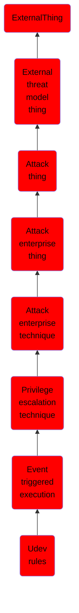

# Udev rules

## Overview

### Definition
Adversaries may maintain persistence through executing malicious content triggered using udev rules. Udev is the Linux kernel device manager that dynamically manages device nodes, handles access to pseudo-device files in the `/dev` directory, and responds to hardware events, such as when external devices like hard drives or keyboards are plugged in or removed. Udev uses rule files with `match keys` to specify the conditions a hardware event must meet and `action keys` to define the actions that should follow. Root permissions are required to create, modify, or delete rule files located in `/etc/udev/rules.d/`, `/run/udev/rules.d/`, `/usr/lib/udev/rules.d/`, `/usr/local/lib/udev/rules.d/`, and `/lib/udev/rules.d/`. Rule priority is determined by both directory and by the digit prefix in the rule filename.(Citation: Ignacio Udev research 2024)(Citation: Elastic Linux Persistence 2024)

### Examples
Not defined.

### Aliases
Not defined.

### URI
http://d3fend.mitre.org/ontologies/d3fend.owl#T1546.017

### Subclass Of

- [ExternalThing](/docs/ontology/reference/model/ExternalThing/ExternalThing.md)
- [External threat model thing](/docs/ontology/reference/model/ExternalThing/External%20threat%20model%20thing/External%20threat%20model%20thing.md)
- [Attack thing](/docs/ontology/reference/model/ExternalThing/External%20threat%20model%20thing/Attack%20thing/Attack%20thing.md)
- [Attack enterprise thing](/docs/ontology/reference/model/ExternalThing/External%20threat%20model%20thing/Attack%20thing/Attack%20enterprise%20thing/Attack%20enterprise%20thing.md)
- [Attack enterprise technique](/docs/ontology/reference/model/ExternalThing/External%20threat%20model%20thing/Attack%20thing/Attack%20enterprise%20thing/Attack%20enterprise%20technique/Attack%20enterprise%20technique.md)
- [Privilege escalation technique](/docs/ontology/reference/model/ExternalThing/External%20threat%20model%20thing/Attack%20thing/Attack%20enterprise%20thing/Attack%20enterprise%20technique/Privilege%20escalation%20technique/Privilege%20escalation%20technique.md)
- [Event triggered execution](/docs/ontology/reference/model/ExternalThing/External%20threat%20model%20thing/Attack%20thing/Attack%20enterprise%20thing/Attack%20enterprise%20technique/Privilege%20escalation%20technique/Event%20triggered%20execution/Event%20triggered%20execution.md)
- [Udev rules](/docs/ontology/reference/model/ExternalThing/External%20threat%20model%20thing/Attack%20thing/Attack%20enterprise%20thing/Attack%20enterprise%20technique/Privilege%20escalation%20technique/Event%20triggered%20execution/Udev%20rules/Udev%20rules.md)

### Ontology Reference
- [d3fend](http://d3fend.mitre.org/ontologies/d3fend.owl#)

## Properties
