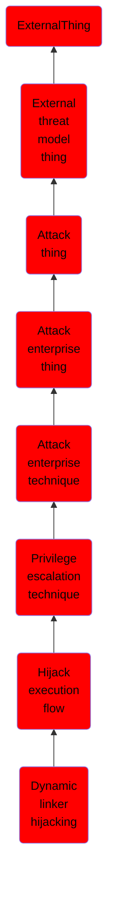

# Dynamic linker hijacking

## Overview

### Definition
Adversaries may execute their own malicious payloads by hijacking environment variables the dynamic linker uses to load shared libraries. During the execution preparation phase of a program, the dynamic linker loads specified absolute paths of shared libraries from environment variables and files, such as <code>LD_PRELOAD</code> on Linux or <code>DYLD_INSERT_LIBRARIES</code> on macOS. Libraries specified in environment variables are loaded first, taking precedence over system libraries with the same function name.(Citation: Man LD.SO)(Citation: TLDP Shared Libraries)(Citation: Apple Doco Archive Dynamic Libraries) These variables are often used by developers to debug binaries without needing to recompile, deconflict mapped symbols, and implement custom functions without changing the original library.(Citation: Baeldung LD_PRELOAD)

### Examples
Not defined.

### Aliases
Not defined.

### URI
http://d3fend.mitre.org/ontologies/d3fend.owl#T1574.006

### Subclass Of

- [ExternalThing](/docs/ontology/reference/model/ExternalThing/ExternalThing.md)
- [External threat model thing](/docs/ontology/reference/model/ExternalThing/External%20threat%20model%20thing/External%20threat%20model%20thing.md)
- [Attack thing](/docs/ontology/reference/model/ExternalThing/External%20threat%20model%20thing/Attack%20thing/Attack%20thing.md)
- [Attack enterprise thing](/docs/ontology/reference/model/ExternalThing/External%20threat%20model%20thing/Attack%20thing/Attack%20enterprise%20thing/Attack%20enterprise%20thing.md)
- [Attack enterprise technique](/docs/ontology/reference/model/ExternalThing/External%20threat%20model%20thing/Attack%20thing/Attack%20enterprise%20thing/Attack%20enterprise%20technique/Attack%20enterprise%20technique.md)
- [Privilege escalation technique](/docs/ontology/reference/model/ExternalThing/External%20threat%20model%20thing/Attack%20thing/Attack%20enterprise%20thing/Attack%20enterprise%20technique/Privilege%20escalation%20technique/Privilege%20escalation%20technique.md)
- [Hijack execution flow](/docs/ontology/reference/model/ExternalThing/External%20threat%20model%20thing/Attack%20thing/Attack%20enterprise%20thing/Attack%20enterprise%20technique/Privilege%20escalation%20technique/Hijack%20execution%20flow/Hijack%20execution%20flow.md)
- [Dynamic linker hijacking](/docs/ontology/reference/model/ExternalThing/External%20threat%20model%20thing/Attack%20thing/Attack%20enterprise%20thing/Attack%20enterprise%20technique/Privilege%20escalation%20technique/Hijack%20execution%20flow/Dynamic%20linker%20hijacking/Dynamic%20linker%20hijacking.md)

### Ontology Reference
- [d3fend](http://d3fend.mitre.org/ontologies/d3fend.owl#)

## Properties
