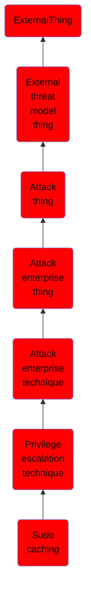

# Sudo caching

## Overview

### Definition
The <code>sudo</code> command "allows a system administrator to delegate authority to give certain users (or groups of users) the ability to run some (or all) commands as root or another user while providing an audit trail of the commands and their arguments." (Citation: sudo man page 2018) Since sudo was made for the system administrator, it has some useful configuration features such as a <code>timestamp_timeout</code> that is the amount of time in minutes between instances of <code>sudo</code> before it will re-prompt for a password. This is because <code>sudo</code> has the ability to cache credentials for a period of time. Sudo creates (or touches) a file at <code>/var/db/sudo</code> with a timestamp of when sudo was last run to determine this timeout. Additionally, there is a <code>tty_tickets</code> variable that treats each new tty (terminal session) in isolation. This means that, for example, the sudo timeout of one tty will not affect another tty (you will have to type the password again).

### Examples
Not defined.

### Aliases
Not defined.

### URI
http://d3fend.mitre.org/ontologies/d3fend.owl#T1206

### Subclass Of

- [ExternalThing](/docs/ontology/reference/model/ExternalThing/ExternalThing.md)
- [External threat model thing](/docs/ontology/reference/model/ExternalThing/External%20threat%20model%20thing/External%20threat%20model%20thing.md)
- [Attack thing](/docs/ontology/reference/model/ExternalThing/External%20threat%20model%20thing/Attack%20thing/Attack%20thing.md)
- [Attack enterprise thing](/docs/ontology/reference/model/ExternalThing/External%20threat%20model%20thing/Attack%20thing/Attack%20enterprise%20thing/Attack%20enterprise%20thing.md)
- [Attack enterprise technique](/docs/ontology/reference/model/ExternalThing/External%20threat%20model%20thing/Attack%20thing/Attack%20enterprise%20thing/Attack%20enterprise%20technique/Attack%20enterprise%20technique.md)
- [Privilege escalation technique](/docs/ontology/reference/model/ExternalThing/External%20threat%20model%20thing/Attack%20thing/Attack%20enterprise%20thing/Attack%20enterprise%20technique/Privilege%20escalation%20technique/Privilege%20escalation%20technique.md)
- [Sudo caching](/docs/ontology/reference/model/ExternalThing/External%20threat%20model%20thing/Attack%20thing/Attack%20enterprise%20thing/Attack%20enterprise%20technique/Privilege%20escalation%20technique/Sudo%20caching/Sudo%20caching.md)

### Ontology Reference
- [d3fend](http://d3fend.mitre.org/ontologies/d3fend.owl#)

## Properties
