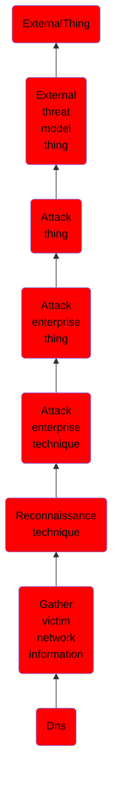

# Dns

## Overview

### Definition
Adversaries may gather information about the victim's DNS that can be used during targeting. DNS information may include a variety of details, including registered name servers as well as records that outline addressing for a target’s subdomains, mail servers, and other hosts. DNS, MX, TXT, and SPF records may also reveal the use of third party cloud and SaaS providers, such as Office 365, G Suite, Salesforce, or Zendesk.(Citation: Sean Metcalf Twitter DNS Records)

### Examples
Not defined.

### Aliases
Not defined.

### URI
http://d3fend.mitre.org/ontologies/d3fend.owl#T1590.002

### Subclass Of

- [ExternalThing](/docs/ontology/reference/model/ExternalThing/ExternalThing.md)
- [External threat model thing](/docs/ontology/reference/model/ExternalThing/External%20threat%20model%20thing/External%20threat%20model%20thing.md)
- [Attack thing](/docs/ontology/reference/model/ExternalThing/External%20threat%20model%20thing/Attack%20thing/Attack%20thing.md)
- [Attack enterprise thing](/docs/ontology/reference/model/ExternalThing/External%20threat%20model%20thing/Attack%20thing/Attack%20enterprise%20thing/Attack%20enterprise%20thing.md)
- [Attack enterprise technique](/docs/ontology/reference/model/ExternalThing/External%20threat%20model%20thing/Attack%20thing/Attack%20enterprise%20thing/Attack%20enterprise%20technique/Attack%20enterprise%20technique.md)
- [Reconnaissance technique](/docs/ontology/reference/model/ExternalThing/External%20threat%20model%20thing/Attack%20thing/Attack%20enterprise%20thing/Attack%20enterprise%20technique/Reconnaissance%20technique/Reconnaissance%20technique.md)
- [Gather victim network information](/docs/ontology/reference/model/ExternalThing/External%20threat%20model%20thing/Attack%20thing/Attack%20enterprise%20thing/Attack%20enterprise%20technique/Reconnaissance%20technique/Gather%20victim%20network%20information/Gather%20victim%20network%20information.md)
- [Dns](/docs/ontology/reference/model/ExternalThing/External%20threat%20model%20thing/Attack%20thing/Attack%20enterprise%20thing/Attack%20enterprise%20technique/Reconnaissance%20technique/Gather%20victim%20network%20information/Dns/Dns.md)

### Ontology Reference
- [d3fend](http://d3fend.mitre.org/ontologies/d3fend.owl#)

## Properties
