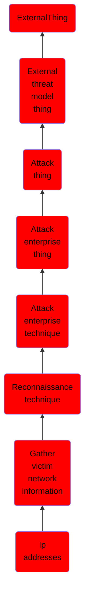

# Ip addresses

## Overview

### Definition
Adversaries may gather the victim's IP addresses that can be used during targeting. Public IP addresses may be allocated to organizations by block, or a range of sequential addresses. Information about assigned IP addresses may include a variety of details, such as which IP addresses are in use. IP addresses may also enable an adversary to derive other details about a victim, such as organizational size, physical location(s), Internet service provider, and or where/how their publicly-facing infrastructure is hosted.

### Examples
Not defined.

### Aliases
Not defined.

### URI
http://d3fend.mitre.org/ontologies/d3fend.owl#T1590.005

### Subclass Of

- [ExternalThing](/docs/ontology/reference/model/ExternalThing/ExternalThing.md)
- [External threat model thing](/docs/ontology/reference/model/ExternalThing/External%20threat%20model%20thing/External%20threat%20model%20thing.md)
- [Attack thing](/docs/ontology/reference/model/ExternalThing/External%20threat%20model%20thing/Attack%20thing/Attack%20thing.md)
- [Attack enterprise thing](/docs/ontology/reference/model/ExternalThing/External%20threat%20model%20thing/Attack%20thing/Attack%20enterprise%20thing/Attack%20enterprise%20thing.md)
- [Attack enterprise technique](/docs/ontology/reference/model/ExternalThing/External%20threat%20model%20thing/Attack%20thing/Attack%20enterprise%20thing/Attack%20enterprise%20technique/Attack%20enterprise%20technique.md)
- [Reconnaissance technique](/docs/ontology/reference/model/ExternalThing/External%20threat%20model%20thing/Attack%20thing/Attack%20enterprise%20thing/Attack%20enterprise%20technique/Reconnaissance%20technique/Reconnaissance%20technique.md)
- [Gather victim network information](/docs/ontology/reference/model/ExternalThing/External%20threat%20model%20thing/Attack%20thing/Attack%20enterprise%20thing/Attack%20enterprise%20technique/Reconnaissance%20technique/Gather%20victim%20network%20information/Gather%20victim%20network%20information.md)
- [Ip addresses](/docs/ontology/reference/model/ExternalThing/External%20threat%20model%20thing/Attack%20thing/Attack%20enterprise%20thing/Attack%20enterprise%20technique/Reconnaissance%20technique/Gather%20victim%20network%20information/Ip%20addresses/Ip%20addresses.md)

### Ontology Reference
- [d3fend](http://d3fend.mitre.org/ontologies/d3fend.owl#)

## Properties
