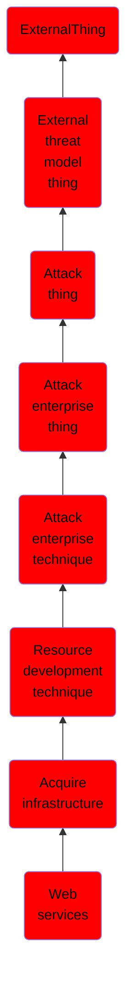

# Web services

## Overview

### Definition
Adversaries may register for web services that can be used during targeting. A variety of popular websites exist for adversaries to register for a web-based service that can be abused during later stages of the adversary lifecycle, such as during Command and Control ([Web Service](https://attack.mitre.org/techniques/T1102)), [Exfiltration Over Web Service](https://attack.mitre.org/techniques/T1567), or [Phishing](https://attack.mitre.org/techniques/T1566). Using common services, such as those offered by Google or Twitter, makes it easier for adversaries to hide in expected noise.(Citation: FireEye APT29) By utilizing a web service, adversaries can make it difficult to physically tie back operations to them.

### Examples
Not defined.

### Aliases
Not defined.

### URI
http://d3fend.mitre.org/ontologies/d3fend.owl#T1583.006

### Subclass Of

- [ExternalThing](/docs/ontology/reference/model/ExternalThing/ExternalThing.md)
- [External threat model thing](/docs/ontology/reference/model/ExternalThing/External%20threat%20model%20thing/External%20threat%20model%20thing.md)
- [Attack thing](/docs/ontology/reference/model/ExternalThing/External%20threat%20model%20thing/Attack%20thing/Attack%20thing.md)
- [Attack enterprise thing](/docs/ontology/reference/model/ExternalThing/External%20threat%20model%20thing/Attack%20thing/Attack%20enterprise%20thing/Attack%20enterprise%20thing.md)
- [Attack enterprise technique](/docs/ontology/reference/model/ExternalThing/External%20threat%20model%20thing/Attack%20thing/Attack%20enterprise%20thing/Attack%20enterprise%20technique/Attack%20enterprise%20technique.md)
- [Resource development technique](/docs/ontology/reference/model/ExternalThing/External%20threat%20model%20thing/Attack%20thing/Attack%20enterprise%20thing/Attack%20enterprise%20technique/Resource%20development%20technique/Resource%20development%20technique.md)
- [Acquire infrastructure](/docs/ontology/reference/model/ExternalThing/External%20threat%20model%20thing/Attack%20thing/Attack%20enterprise%20thing/Attack%20enterprise%20technique/Resource%20development%20technique/Acquire%20infrastructure/Acquire%20infrastructure.md)
- [Web services](/docs/ontology/reference/model/ExternalThing/External%20threat%20model%20thing/Attack%20thing/Attack%20enterprise%20thing/Attack%20enterprise%20technique/Resource%20development%20technique/Acquire%20infrastructure/Web%20services/Web%20services.md)

### Ontology Reference
- [d3fend](http://d3fend.mitre.org/ontologies/d3fend.owl#)

## Properties
