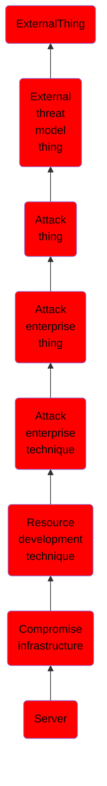

# Server

## Overview

### Definition
Adversaries may compromise third-party servers that can be used during targeting. Use of servers allows an adversary to stage, launch, and execute an operation. During post-compromise activity, adversaries may utilize servers for various tasks, including for Command and Control.(Citation: TrendMicro EarthLusca 2022) Instead of purchasing a [Server](https://attack.mitre.org/techniques/T1583/004) or [Virtual Private Server](https://attack.mitre.org/techniques/T1583/003), adversaries may compromise third-party servers in support of operations.

### Examples
Not defined.

### Aliases
Not defined.

### URI
http://d3fend.mitre.org/ontologies/d3fend.owl#T1584.004

### Subclass Of

- [ExternalThing](/docs/ontology/reference/model/ExternalThing/ExternalThing.md)
- [External threat model thing](/docs/ontology/reference/model/ExternalThing/External%20threat%20model%20thing/External%20threat%20model%20thing.md)
- [Attack thing](/docs/ontology/reference/model/ExternalThing/External%20threat%20model%20thing/Attack%20thing/Attack%20thing.md)
- [Attack enterprise thing](/docs/ontology/reference/model/ExternalThing/External%20threat%20model%20thing/Attack%20thing/Attack%20enterprise%20thing/Attack%20enterprise%20thing.md)
- [Attack enterprise technique](/docs/ontology/reference/model/ExternalThing/External%20threat%20model%20thing/Attack%20thing/Attack%20enterprise%20thing/Attack%20enterprise%20technique/Attack%20enterprise%20technique.md)
- [Resource development technique](/docs/ontology/reference/model/ExternalThing/External%20threat%20model%20thing/Attack%20thing/Attack%20enterprise%20thing/Attack%20enterprise%20technique/Resource%20development%20technique/Resource%20development%20technique.md)
- [Compromise infrastructure](/docs/ontology/reference/model/ExternalThing/External%20threat%20model%20thing/Attack%20thing/Attack%20enterprise%20thing/Attack%20enterprise%20technique/Resource%20development%20technique/Compromise%20infrastructure/Compromise%20infrastructure.md)
- [Server](/docs/ontology/reference/model/ExternalThing/External%20threat%20model%20thing/Attack%20thing/Attack%20enterprise%20thing/Attack%20enterprise%20technique/Resource%20development%20technique/Compromise%20infrastructure/Server/Server.md)

### Ontology Reference
- [d3fend](http://d3fend.mitre.org/ontologies/d3fend.owl#)

## Properties
