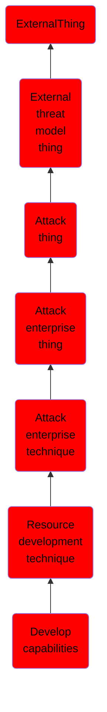

# Develop capabilities

## Overview

### Definition
Adversaries may build capabilities that can be used during targeting. Rather than purchasing, freely downloading, or stealing capabilities, adversaries may develop their own capabilities in-house. This is the process of identifying development requirements and building solutions such as malware, exploits, and self-signed certificates. Adversaries may develop capabilities to support their operations throughout numerous phases of the adversary lifecycle.(Citation: Mandiant APT1)(Citation: Kaspersky Sofacy)(Citation: Bitdefender StrongPity June 2020)(Citation: Talos Promethium June 2020)

### Examples
Not defined.

### Aliases
Not defined.

### URI
http://d3fend.mitre.org/ontologies/d3fend.owl#T1587

### Subclass Of

- [ExternalThing](/docs/ontology/reference/model/ExternalThing/ExternalThing.md)
- [External threat model thing](/docs/ontology/reference/model/ExternalThing/External%20threat%20model%20thing/External%20threat%20model%20thing.md)
- [Attack thing](/docs/ontology/reference/model/ExternalThing/External%20threat%20model%20thing/Attack%20thing/Attack%20thing.md)
- [Attack enterprise thing](/docs/ontology/reference/model/ExternalThing/External%20threat%20model%20thing/Attack%20thing/Attack%20enterprise%20thing/Attack%20enterprise%20thing.md)
- [Attack enterprise technique](/docs/ontology/reference/model/ExternalThing/External%20threat%20model%20thing/Attack%20thing/Attack%20enterprise%20thing/Attack%20enterprise%20technique/Attack%20enterprise%20technique.md)
- [Resource development technique](/docs/ontology/reference/model/ExternalThing/External%20threat%20model%20thing/Attack%20thing/Attack%20enterprise%20thing/Attack%20enterprise%20technique/Resource%20development%20technique/Resource%20development%20technique.md)
- [Develop capabilities](/docs/ontology/reference/model/ExternalThing/External%20threat%20model%20thing/Attack%20thing/Attack%20enterprise%20thing/Attack%20enterprise%20technique/Resource%20development%20technique/Develop%20capabilities/Develop%20capabilities.md)

### Ontology Reference
- [d3fend](http://d3fend.mitre.org/ontologies/d3fend.owl#)

## Properties
