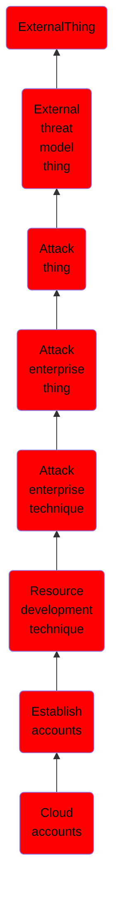

# Cloud accounts

## Overview

### Definition
Adversaries may create accounts with cloud providers that can be used during targeting. Adversaries can use cloud accounts to further their operations, including leveraging cloud storage services such as Dropbox, MEGA, Microsoft OneDrive, or AWS S3 buckets for [Exfiltration to Cloud Storage](https://attack.mitre.org/techniques/T1567/002) or to [Upload Tool](https://attack.mitre.org/techniques/T1608/002)s. Cloud accounts can also be used in the acquisition of infrastructure, such as [Virtual Private Server](https://attack.mitre.org/techniques/T1583/003)s or [Serverless](https://attack.mitre.org/techniques/T1583/007) infrastructure. Establishing cloud accounts may allow adversaries to develop sophisticated capabilities without managing their own servers.(Citation: Awake Security C2 Cloud)

### Examples
Not defined.

### Aliases
Not defined.

### URI
http://d3fend.mitre.org/ontologies/d3fend.owl#T1585.003

### Subclass Of

- [ExternalThing](/docs/ontology/reference/model/ExternalThing/ExternalThing.md)
- [External threat model thing](/docs/ontology/reference/model/ExternalThing/External%20threat%20model%20thing/External%20threat%20model%20thing.md)
- [Attack thing](/docs/ontology/reference/model/ExternalThing/External%20threat%20model%20thing/Attack%20thing/Attack%20thing.md)
- [Attack enterprise thing](/docs/ontology/reference/model/ExternalThing/External%20threat%20model%20thing/Attack%20thing/Attack%20enterprise%20thing/Attack%20enterprise%20thing.md)
- [Attack enterprise technique](/docs/ontology/reference/model/ExternalThing/External%20threat%20model%20thing/Attack%20thing/Attack%20enterprise%20thing/Attack%20enterprise%20technique/Attack%20enterprise%20technique.md)
- [Resource development technique](/docs/ontology/reference/model/ExternalThing/External%20threat%20model%20thing/Attack%20thing/Attack%20enterprise%20thing/Attack%20enterprise%20technique/Resource%20development%20technique/Resource%20development%20technique.md)
- [Establish accounts](/docs/ontology/reference/model/ExternalThing/External%20threat%20model%20thing/Attack%20thing/Attack%20enterprise%20thing/Attack%20enterprise%20technique/Resource%20development%20technique/Establish%20accounts/Establish%20accounts.md)
- [Cloud accounts](/docs/ontology/reference/model/ExternalThing/External%20threat%20model%20thing/Attack%20thing/Attack%20enterprise%20thing/Attack%20enterprise%20technique/Resource%20development%20technique/Establish%20accounts/Cloud%20accounts/Cloud%20accounts.md)

### Ontology Reference
- [d3fend](http://d3fend.mitre.org/ontologies/d3fend.owl#)

## Properties
