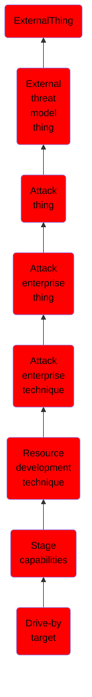

# Drive-by target

## Overview

### Definition
Adversaries may prepare an operational environment to infect systems that visit a website over the normal course of browsing. Endpoint systems may be compromised through browsing to adversary controlled sites, as in [Drive-by Compromise](https://attack.mitre.org/techniques/T1189). In such cases, the user's web browser is typically targeted for exploitation (often not requiring any extra user interaction once landing on the site), but adversaries may also set up websites for non-exploitation behavior such as [Application Access Token](https://attack.mitre.org/techniques/T1550/001). Prior to [Drive-by Compromise](https://attack.mitre.org/techniques/T1189), adversaries must stage resources needed to deliver that exploit to users who browse to an adversary controlled site. Drive-by content can be staged on adversary controlled infrastructure that has been acquired ([Acquire Infrastructure](https://attack.mitre.org/techniques/T1583)) or previously compromised ([Compromise Infrastructure](https://attack.mitre.org/techniques/T1584)).

### Examples
Not defined.

### Aliases
Not defined.

### URI
http://d3fend.mitre.org/ontologies/d3fend.owl#T1608.004

### Subclass Of

- [ExternalThing](/docs/ontology/reference/model/ExternalThing/ExternalThing.md)
- [External threat model thing](/docs/ontology/reference/model/ExternalThing/External%20threat%20model%20thing/External%20threat%20model%20thing.md)
- [Attack thing](/docs/ontology/reference/model/ExternalThing/External%20threat%20model%20thing/Attack%20thing/Attack%20thing.md)
- [Attack enterprise thing](/docs/ontology/reference/model/ExternalThing/External%20threat%20model%20thing/Attack%20thing/Attack%20enterprise%20thing/Attack%20enterprise%20thing.md)
- [Attack enterprise technique](/docs/ontology/reference/model/ExternalThing/External%20threat%20model%20thing/Attack%20thing/Attack%20enterprise%20thing/Attack%20enterprise%20technique/Attack%20enterprise%20technique.md)
- [Resource development technique](/docs/ontology/reference/model/ExternalThing/External%20threat%20model%20thing/Attack%20thing/Attack%20enterprise%20thing/Attack%20enterprise%20technique/Resource%20development%20technique/Resource%20development%20technique.md)
- [Stage capabilities](/docs/ontology/reference/model/ExternalThing/External%20threat%20model%20thing/Attack%20thing/Attack%20enterprise%20thing/Attack%20enterprise%20technique/Resource%20development%20technique/Stage%20capabilities/Stage%20capabilities.md)
- [Drive-by target](/docs/ontology/reference/model/ExternalThing/External%20threat%20model%20thing/Attack%20thing/Attack%20enterprise%20thing/Attack%20enterprise%20technique/Resource%20development%20technique/Stage%20capabilities/Drive-by%20target/Drive-by%20target.md)

### Ontology Reference
- [d3fend](http://d3fend.mitre.org/ontologies/d3fend.owl#)

## Properties
