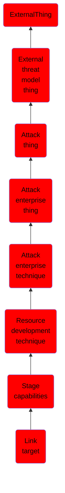

# Link target

## Overview

### Definition
Adversaries may put in place resources that are referenced by a link that can be used during targeting. An adversary may rely upon a user clicking a malicious link in order to divulge information (including credentials) or to gain execution, as in [Malicious Link](https://attack.mitre.org/techniques/T1204/001). Links can be used for spearphishing, such as sending an email accompanied by social engineering text to coax the user to actively click or copy and paste a URL into a browser. Prior to a phish for information (as in [Spearphishing Link](https://attack.mitre.org/techniques/T1598/003)) or a phish to gain initial access to a system (as in [Spearphishing Link](https://attack.mitre.org/techniques/T1566/002)), an adversary must set up the resources for a link target for the spearphishing link.

### Examples
Not defined.

### Aliases
Not defined.

### URI
http://d3fend.mitre.org/ontologies/d3fend.owl#T1608.005

### Subclass Of

- [ExternalThing](/docs/ontology/reference/model/ExternalThing/ExternalThing.md)
- [External threat model thing](/docs/ontology/reference/model/ExternalThing/External%20threat%20model%20thing/External%20threat%20model%20thing.md)
- [Attack thing](/docs/ontology/reference/model/ExternalThing/External%20threat%20model%20thing/Attack%20thing/Attack%20thing.md)
- [Attack enterprise thing](/docs/ontology/reference/model/ExternalThing/External%20threat%20model%20thing/Attack%20thing/Attack%20enterprise%20thing/Attack%20enterprise%20thing.md)
- [Attack enterprise technique](/docs/ontology/reference/model/ExternalThing/External%20threat%20model%20thing/Attack%20thing/Attack%20enterprise%20thing/Attack%20enterprise%20technique/Attack%20enterprise%20technique.md)
- [Resource development technique](/docs/ontology/reference/model/ExternalThing/External%20threat%20model%20thing/Attack%20thing/Attack%20enterprise%20thing/Attack%20enterprise%20technique/Resource%20development%20technique/Resource%20development%20technique.md)
- [Stage capabilities](/docs/ontology/reference/model/ExternalThing/External%20threat%20model%20thing/Attack%20thing/Attack%20enterprise%20thing/Attack%20enterprise%20technique/Resource%20development%20technique/Stage%20capabilities/Stage%20capabilities.md)
- [Link target](/docs/ontology/reference/model/ExternalThing/External%20threat%20model%20thing/Attack%20thing/Attack%20enterprise%20thing/Attack%20enterprise%20technique/Resource%20development%20technique/Stage%20capabilities/Link%20target/Link%20target.md)

### Ontology Reference
- [d3fend](http://d3fend.mitre.org/ontologies/d3fend.owl#)

## Properties
