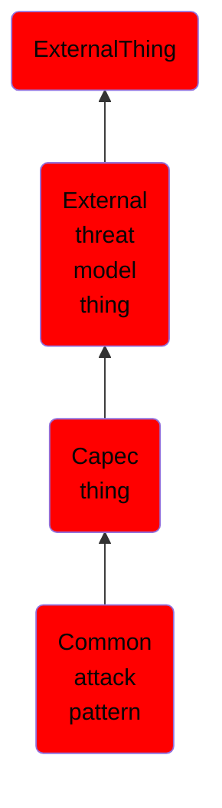

# Common attack pattern

## Overview

### Definition
A common attack pattern that is in the CAPEC knowledge base.

### Examples
Not defined.

### Aliases
Not defined.

### URI
http://d3fend.mitre.org/ontologies/d3fend.owl#CommonAttackPattern

### Subclass Of

- [ExternalThing](/docs/ontology/reference/model/ExternalThing/ExternalThing.md)
- [External threat model thing](/docs/ontology/reference/model/ExternalThing/External%20threat%20model%20thing/External%20threat%20model%20thing.md)
- [Capec thing](/docs/ontology/reference/model/ExternalThing/External%20threat%20model%20thing/Capec%20thing/Capec%20thing.md)
- [Common attack pattern](/docs/ontology/reference/model/ExternalThing/External%20threat%20model%20thing/Capec%20thing/Common%20attack%20pattern/Common%20attack%20pattern.md)

### Ontology Reference
- [d3fend](http://d3fend.mitre.org/ontologies/d3fend.owl#)

## Properties
