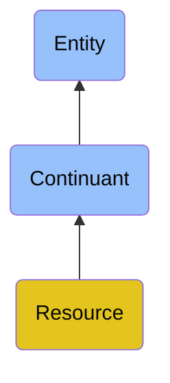

# Resource

## Overview

### Definition
A Continuant that is owned by, in the possession of, or is otherwise controlled by an Agent such that it could be used by that Agent.

### Examples
- a sum of money
- a group of interns
- a plot of land
- a knowledge base
- a software program
- a vehicle

### Aliases
Not defined.

### URI
https://www.commoncoreontologies.org/ont00000740

### Subclass Of

- [Entity](/docs/ontology/reference/full/Entity/Entity.md)
- [Continuant](/docs/ontology/reference/full/Entity/Continuant/Continuant.md)
- [Resource](/docs/ontology/reference/full/Entity/Continuant/Resource/Resource.md)

### Ontology Reference
- [cco](https://www.commoncoreontologies.org/): [ArtifactOntology](https://www.commoncoreontologies.org/ArtifactOntology)

## Properties
### Data Properties
| Ontology | Label | Definition | Example | Domain | Range |
|----------|-------|------------|---------|--------|-------|
| abi | [is curated in foundry](http://ontology.naas.ai/abi/is_curated_in_foundry) | Relates a class to the foundry it is curated in. | The class cco:ont00001262 is curated in the foundry 'enterprise_management_foundry' and 'personal_ai_foundry'. | [entity](/docs/ontology/reference/full/Entity/Entity.md) | [string](http://www.w3.org/2001/XMLSchema#string) |
| abi | [data property](http://ontology.naas.ai/abi/template/dataProperty) | A data property is a property that is used to represent a data property. |  | [entity](/docs/ontology/reference/full/Entity/Entity.md) | [string](http://www.w3.org/2001/XMLSchema#string) |

### Object Properties
| Ontology | Label | Definition | Example | Domain | Range | Inverse Of |
|----------|-------|------------|---------|--------|-------|------------|
| abi | [has backing data source](http://ontology.naas.ai/abi/hasBackingDataSource) | Relates an entity to the data source that provides the underlying data for that entity. This property indicates the origin or source of the data that supports the entity. | A report entity may have a backing data source that provides the raw data used to generate the report. | [entity](/docs/ontology/reference/full/Entity/Entity.md) | [Data Source](/docs/ontology/reference/full/Entity/Continuant/Generically%20dependent%20continuant/Data%20source/Data%20source.md) |  |
| abi | [has template class](http://ontology.naas.ai/abi/template/hasTemplateClass) | Relates a subject to its template class. |  | [entity](/docs/ontology/reference/full/Entity/Entity.md) | [Template Class](/docs/ontology/reference/full/Entity/Continuant/Generically%20dependent%20continuant/Template%20class/Template%20class.md) |  |
| bfo | [exists at](http://purl.obolibrary.org/obo/BFO_0000108) | (Elucidation) exists at is a relation between a particular and some temporal region at which the particular exists | First World War exists at 1914-1916; Mexico exists at January 1, 2000 | [entity](/docs/ontology/reference/full/Entity/Entity.md) | [temporal region](/docs/ontology/reference/full/Entity/Occurrent/Temporal%20region/Temporal%20region.md) |  |
| bfo | [continuant part of](http://purl.obolibrary.org/obo/BFO_0000176) | b continuant part of c =Def b and c are continuants & there is some time t such that b and c exist at t & b continuant part of c at t | Milk teeth continuant part of human; surgically removed tumour continuant part of organism | [continuant](/docs/ontology/reference/full/Entity/Continuant/Continuant.md) | [continuant](/docs/ontology/reference/full/Entity/Continuant/Continuant.md) | [has continuant part](http://purl.obolibrary.org/obo/BFO_0000178) |
| bfo | [has continuant part](http://purl.obolibrary.org/obo/BFO_0000178) | b has continuant part c =Def c continuant part of b |  | [continuant](/docs/ontology/reference/full/Entity/Continuant/Continuant.md) | [continuant](/docs/ontology/reference/full/Entity/Continuant/Continuant.md) |  |
| cco | [is output of](https://www.commoncoreontologies.org/ont00001816) | x is_output_of y iff x is an instance of Continuant and y is an instance of Process, such that the presence of x at the end of y is a necessary condition for the completion of y. |  | [continuant](/docs/ontology/reference/full/Entity/Continuant/Continuant.md) | [process](/docs/ontology/reference/full/Entity/Occurrent/Process/Process.md) | [has output](https://www.commoncoreontologies.org/ont00001986) |
| cco | [is input of](https://www.commoncoreontologies.org/ont00001841) | x is_input_of y iff x is an instance of Continuant and y is an instance of Process, such that the presence of x at the beginning of y is a necessary condition for the start of y. |  | [continuant](/docs/ontology/reference/full/Entity/Continuant/Continuant.md) | [process](/docs/ontology/reference/full/Entity/Occurrent/Process/Process.md) | [has input](https://www.commoncoreontologies.org/ont00001921) |
| cco | [is affected by](https://www.commoncoreontologies.org/ont00001886) | x is_affected_by y iff x is an instance of Continuant and y is an instance of Process, and y influences x in some manner, most often by producing a change in x. |  | [continuant](/docs/ontology/reference/full/Entity/Continuant/Continuant.md) | [process](/docs/ontology/reference/full/Entity/Occurrent/Process/Process.md) |  |

