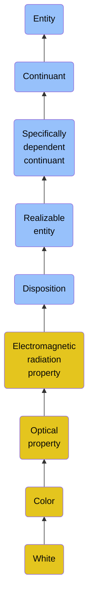

# White

## Overview

### Definition
A Color of maximum brightness, the color of objects that reflect nearly all wavelengths of the visible light spectrum, thus considered achromatic.

### Examples
Not defined.

### Aliases
Not defined.

### URI
https://www.commoncoreontologies.org/ont00000528

### Subclass Of

- [Entity](/docs/ontology/reference/full/Entity/Entity.md)
- [Continuant](/docs/ontology/reference/full/Entity/Continuant/Continuant.md)
- [Specifically dependent continuant](/docs/ontology/reference/full/Entity/Continuant/Specifically%20dependent%20continuant/Specifically%20dependent%20continuant.md)
- [Realizable entity](/docs/ontology/reference/full/Entity/Continuant/Specifically%20dependent%20continuant/Realizable%20entity/Realizable%20entity.md)
- [Disposition](/docs/ontology/reference/full/Entity/Continuant/Specifically%20dependent%20continuant/Realizable%20entity/Disposition/Disposition.md)
- [Electromagnetic radiation property](/docs/ontology/reference/full/Entity/Continuant/Specifically%20dependent%20continuant/Realizable%20entity/Disposition/Electromagnetic%20radiation%20property/Electromagnetic%20radiation%20property.md)
- [Optical property](/docs/ontology/reference/full/Entity/Continuant/Specifically%20dependent%20continuant/Realizable%20entity/Disposition/Electromagnetic%20radiation%20property/Optical%20property/Optical%20property.md)
- [Color](/docs/ontology/reference/full/Entity/Continuant/Specifically%20dependent%20continuant/Realizable%20entity/Disposition/Electromagnetic%20radiation%20property/Optical%20property/Color/Color.md)
- [White](/docs/ontology/reference/full/Entity/Continuant/Specifically%20dependent%20continuant/Realizable%20entity/Disposition/Electromagnetic%20radiation%20property/Optical%20property/Color/White/White.md)

### Ontology Reference
- [cco](https://www.commoncoreontologies.org/): [QualityOntology](https://www.commoncoreontologies.org/QualityOntology)

## Properties
### Data Properties
| Ontology | Label | Definition | Example | Domain | Range |
|----------|-------|------------|---------|--------|-------|
| abi | [is curated in foundry](http://ontology.naas.ai/abi/is_curated_in_foundry) | Relates a class to the foundry it is curated in. | The class cco:ont00001262 is curated in the foundry 'enterprise_management_foundry' and 'personal_ai_foundry'. | [entity](/docs/ontology/reference/full/Entity/Entity.md) | [string](http://www.w3.org/2001/XMLSchema#string) |
| abi | [data property](http://ontology.naas.ai/abi/template/dataProperty) | A data property is a property that is used to represent a data property. |  | [entity](/docs/ontology/reference/full/Entity/Entity.md) | [string](http://www.w3.org/2001/XMLSchema#string) |

### Object Properties
| Ontology | Label | Definition | Example | Domain | Range | Inverse Of |
|----------|-------|------------|---------|--------|-------|------------|
| abi | [has backing data source](http://ontology.naas.ai/abi/hasBackingDataSource) | Relates an entity to the data source that provides the underlying data for that entity. This property indicates the origin or source of the data that supports the entity. | A report entity may have a backing data source that provides the raw data used to generate the report. | [entity](/docs/ontology/reference/full/Entity/Entity.md) | [Data Source](/docs/ontology/reference/full/Entity/Continuant/Generically%20dependent%20continuant/Data%20source/Data%20source.md) |  |
| abi | [has template class](http://ontology.naas.ai/abi/template/hasTemplateClass) | Relates a subject to its template class. |  | [entity](/docs/ontology/reference/full/Entity/Entity.md) | [Template Class](/docs/ontology/reference/full/Entity/Continuant/Generically%20dependent%20continuant/Template%20class/Template%20class.md) |  |
| bfo | [exists at](http://purl.obolibrary.org/obo/BFO_0000108) | (Elucidation) exists at is a relation between a particular and some temporal region at which the particular exists | First World War exists at 1914-1916; Mexico exists at January 1, 2000 | [entity](/docs/ontology/reference/full/Entity/Entity.md) | [temporal region](/docs/ontology/reference/full/Entity/Occurrent/Temporal%20region/Temporal%20region.md) |  |
| bfo | [continuant part of](http://purl.obolibrary.org/obo/BFO_0000176) | b continuant part of c =Def b and c are continuants & there is some time t such that b and c exist at t & b continuant part of c at t | Milk teeth continuant part of human; surgically removed tumour continuant part of organism | [continuant](/docs/ontology/reference/full/Entity/Continuant/Continuant.md) | [continuant](/docs/ontology/reference/full/Entity/Continuant/Continuant.md) | [has continuant part](http://purl.obolibrary.org/obo/BFO_0000178) |
| bfo | [has continuant part](http://purl.obolibrary.org/obo/BFO_0000178) | b has continuant part c =Def c continuant part of b |  | [continuant](/docs/ontology/reference/full/Entity/Continuant/Continuant.md) | [continuant](/docs/ontology/reference/full/Entity/Continuant/Continuant.md) |  |
| cco | [is output of](https://www.commoncoreontologies.org/ont00001816) | x is_output_of y iff x is an instance of Continuant and y is an instance of Process, such that the presence of x at the end of y is a necessary condition for the completion of y. |  | [continuant](/docs/ontology/reference/full/Entity/Continuant/Continuant.md) | [process](/docs/ontology/reference/full/Entity/Occurrent/Process/Process.md) | [has output](https://www.commoncoreontologies.org/ont00001986) |
| cco | [is input of](https://www.commoncoreontologies.org/ont00001841) | x is_input_of y iff x is an instance of Continuant and y is an instance of Process, such that the presence of x at the beginning of y is a necessary condition for the start of y. |  | [continuant](/docs/ontology/reference/full/Entity/Continuant/Continuant.md) | [process](/docs/ontology/reference/full/Entity/Occurrent/Process/Process.md) | [has input](https://www.commoncoreontologies.org/ont00001921) |
| cco | [is affected by](https://www.commoncoreontologies.org/ont00001886) | x is_affected_by y iff x is an instance of Continuant and y is an instance of Process, and y influences x in some manner, most often by producing a change in x. |  | [continuant](/docs/ontology/reference/full/Entity/Continuant/Continuant.md) | [process](/docs/ontology/reference/full/Entity/Occurrent/Process/Process.md) |  |
| bfo | [specifically depends on](http://purl.obolibrary.org/obo/BFO_0000195) | (Elucidation) specifically depends on is a relation between a specifically dependent continuant b and specifically dependent continuant or independent continuant that is not a spatial region c such that b and c share no parts in common & b is of a nature such that at all times t it cannot exist unless c exists & b is not a boundary of c | A shape specifically depends on the shaped object; hue, saturation and brightness of a colour sample specifically depends on each other | [specifically dependent continuant](/docs/ontology/reference/full/Entity/Continuant/Specifically%20dependent%20continuant/Specifically%20dependent%20continuant.md) | [{'or': ['http://purl.obolibrary.org/obo/BFO_0000020', {'and': ['http://purl.obolibrary.org/obo/BFO_0000004', {'not': ['http://purl.obolibrary.org/obo/BFO_0000006']}]}]}](/docs/ontology/reference/full/%7B%27or%27%3A%20%5B%27http%3A//purl.obolibrary.org/obo/BFO_0000020%27%2C%20%7B%27and%27%3A%20%5B%27http%3A//purl.obolibrary.org/obo/BFO_0000004%27%2C%20%7B%27not%27%3A%20%5B%27http%3A//purl.obolibrary.org/obo/BFO_0000006%27%5D%7D%5D%7D%5D%7D/%7B%27or%27%3A%20%5B%27http%3A//purl.obolibrary.org/obo/bfo_0000020%27%2C%20%7B%27and%27%3A%20%5B%27http%3A//purl.obolibrary.org/obo/bfo_0000004%27%2C%20%7B%27not%27%3A%20%5B%27http%3A//purl.obolibrary.org/obo/bfo_0000006%27%5D%7D%5D%7D%5D%7D.md) |  |
| bfo | [inheres in](http://purl.obolibrary.org/obo/BFO_0000197) | b inheres in c =Def b is a specifically dependent continuant & c is an independent continuant that is not a spatial region & b specifically depends on c | A shape inheres in a shaped object; a mass inheres in a material entity | [specifically dependent continuant](/docs/ontology/reference/full/Entity/Continuant/Specifically%20dependent%20continuant/Specifically%20dependent%20continuant.md) | [{'and': ['http://purl.obolibrary.org/obo/BFO_0000004', {'not': ['http://purl.obolibrary.org/obo/BFO_0000006']}]}](/docs/ontology/reference/full/%7B%27and%27%3A%20%5B%27http%3A//purl.obolibrary.org/obo/BFO_0000004%27%2C%20%7B%27not%27%3A%20%5B%27http%3A//purl.obolibrary.org/obo/BFO_0000006%27%5D%7D%5D%7D/%7B%27and%27%3A%20%5B%27http%3A//purl.obolibrary.org/obo/bfo_0000004%27%2C%20%7B%27not%27%3A%20%5B%27http%3A//purl.obolibrary.org/obo/bfo_0000006%27%5D%7D%5D%7D.md) |  |
| bfo | [has realization](http://purl.obolibrary.org/obo/BFO_0000054) | b has realization c =Def c realizes b | As for realizes | [realizable entity](/docs/ontology/reference/full/Entity/Continuant/Specifically%20dependent%20continuant/Realizable%20entity/Realizable%20entity.md) | [process](/docs/ontology/reference/full/Entity/Occurrent/Process/Process.md) | [realizes](http://purl.obolibrary.org/obo/BFO_0000055) |
|  | [is realized by](nce8d636f284d46b6a20c9612d7cf8f39b10) |  |  | [realizable entity](/docs/ontology/reference/full/Entity/Continuant/Specifically%20dependent%20continuant/Realizable%20entity/Realizable%20entity.md) | [process](/docs/ontology/reference/full/Entity/Occurrent/Process/Process.md) |  |
|  | [is capability of](nce8d636f284d46b6a20c9612d7cf8f39b9) |  |  | [realizable entity](/docs/ontology/reference/full/Entity/Continuant/Specifically%20dependent%20continuant/Realizable%20entity/Realizable%20entity.md) | [material entity](/docs/ontology/reference/full/Entity/Continuant/Independent%20continuant/Material%20entity/Material%20entity.md) |  |
| bfo | [has material basis](http://purl.obolibrary.org/obo/BFO_0000218) | b has material basis c =Def b is a disposition & c is a material entity & there is some d bearer of b & there is some time t such that c is a continuant part of d at t & d has disposition b because c is a continuant part of d at t |  | [disposition](/docs/ontology/reference/full/Entity/Continuant/Specifically%20dependent%20continuant/Realizable%20entity/Disposition/Disposition.md) | [material entity](/docs/ontology/reference/full/Entity/Continuant/Independent%20continuant/Material%20entity/Material%20entity.md) |  |
| cco | [disposition of aggregate](https://www.commoncoreontologies.org/ont00001829) | x disposition_of_aggregate y iff y is an instance of Object Aggregate and x is an instance of Disposition, and x inheres_in_aggregate y. |  | [disposition](/docs/ontology/reference/full/Entity/Continuant/Specifically%20dependent%20continuant/Realizable%20entity/Disposition/Disposition.md) | [object aggregate](/docs/ontology/reference/full/Entity/Continuant/Independent%20continuant/Material%20entity/Object%20aggregate/Object%20aggregate.md) | [aggregate has disposition](https://www.commoncoreontologies.org/ont00001956) |

