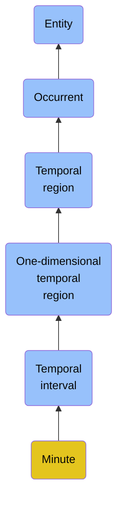

# Minute

## Overview

### Definition
A Temporal Interval that is equal to sixty consecutive Seconds.

### Examples
Not defined.

### Aliases
Not defined.

### URI
https://www.commoncoreontologies.org/ont00000085

### Subclass Of

- [Entity](/docs/ontology/reference/full/Entity/Entity.md)
- [Occurrent](/docs/ontology/reference/full/Entity/Occurrent/Occurrent.md)
- [Temporal region](/docs/ontology/reference/full/Entity/Occurrent/Temporal%20region/Temporal%20region.md)
- [One-dimensional temporal region](/docs/ontology/reference/full/Entity/Occurrent/Temporal%20region/One-dimensional%20temporal%20region/One-dimensional%20temporal%20region.md)
- [Temporal interval](/docs/ontology/reference/full/Entity/Occurrent/Temporal%20region/One-dimensional%20temporal%20region/Temporal%20interval/Temporal%20interval.md)
- [Minute](/docs/ontology/reference/full/Entity/Occurrent/Temporal%20region/One-dimensional%20temporal%20region/Temporal%20interval/Minute/Minute.md)

### Ontology Reference
- [cco](https://www.commoncoreontologies.org/): [TimeOntology](https://www.commoncoreontologies.org/TimeOntology)

## Properties
### Data Properties
| Ontology | Label | Definition | Example | Domain | Range |
|----------|-------|------------|---------|--------|-------|
| abi | [is curated in foundry](http://ontology.naas.ai/abi/is_curated_in_foundry) | Relates a class to the foundry it is curated in. | The class cco:ont00001262 is curated in the foundry 'enterprise_management_foundry' and 'personal_ai_foundry'. | [entity](/docs/ontology/reference/full/Entity/Entity.md) | [string](http://www.w3.org/2001/XMLSchema#string) |
| abi | [data property](http://ontology.naas.ai/abi/template/dataProperty) | A data property is a property that is used to represent a data property. |  | [entity](/docs/ontology/reference/full/Entity/Entity.md) | [string](http://www.w3.org/2001/XMLSchema#string) |

### Object Properties
| Ontology | Label | Definition | Example | Domain | Range | Inverse Of |
|----------|-------|------------|---------|--------|-------|------------|
| abi | [has backing data source](http://ontology.naas.ai/abi/hasBackingDataSource) | Relates an entity to the data source that provides the underlying data for that entity. This property indicates the origin or source of the data that supports the entity. | A report entity may have a backing data source that provides the raw data used to generate the report. | [entity](/docs/ontology/reference/full/Entity/Entity.md) | [Data Source](/docs/ontology/reference/full/Entity/Continuant/Generically%20dependent%20continuant/Data%20source/Data%20source.md) |  |
| abi | [has template class](http://ontology.naas.ai/abi/template/hasTemplateClass) | Relates a subject to its template class. |  | [entity](/docs/ontology/reference/full/Entity/Entity.md) | [Template Class](/docs/ontology/reference/full/Entity/Continuant/Generically%20dependent%20continuant/Template%20class/Template%20class.md) |  |
| bfo | [exists at](http://purl.obolibrary.org/obo/BFO_0000108) | (Elucidation) exists at is a relation between a particular and some temporal region at which the particular exists | First World War exists at 1914-1916; Mexico exists at January 1, 2000 | [entity](/docs/ontology/reference/full/Entity/Entity.md) | [temporal region](/docs/ontology/reference/full/Entity/Occurrent/Temporal%20region/Temporal%20region.md) |  |
| bfo | [preceded by](http://purl.obolibrary.org/obo/BFO_0000062) | b preceded by c =Def b precedes c | The temporal region occupied by the second half of the match is preceded by the temporal region occupied by the first half of the match | [occurrent](/docs/ontology/reference/full/Entity/Occurrent/Occurrent.md) | [occurrent](/docs/ontology/reference/full/Entity/Occurrent/Occurrent.md) | [precedes](http://purl.obolibrary.org/obo/BFO_0000063) |
| bfo | [precedes](http://purl.obolibrary.org/obo/BFO_0000063) | (Elucidation) precedes is a relation between occurrents o, o' such that if t is the temporal extent of o & t' is the temporal extent of o' then either the last instant of o is before the first instant of o' or the last instant of o is the first instant of o' & neither o nor o' are temporal instants | The temporal region occupied by Mary's birth precedes the temporal region occupied by Mary's death. | [occurrent](/docs/ontology/reference/full/Entity/Occurrent/Occurrent.md) | [occurrent](/docs/ontology/reference/full/Entity/Occurrent/Occurrent.md) |  |
| bfo | [has occurrent part](http://purl.obolibrary.org/obo/BFO_0000117) | b has occurrent part c =Def c occurrent part of b | Mary's life has occurrent part Mary's 5th birthday | [occurrent](/docs/ontology/reference/full/Entity/Occurrent/Occurrent.md) | [occurrent](/docs/ontology/reference/full/Entity/Occurrent/Occurrent.md) | [occurrent part of](http://purl.obolibrary.org/obo/BFO_0000132) |
| bfo | [has temporal part](http://purl.obolibrary.org/obo/BFO_0000121) | b has temporal part c =Def c temporal part of b | Your life has temporal part the first year of your life | [occurrent](/docs/ontology/reference/full/Entity/Occurrent/Occurrent.md) | [occurrent](/docs/ontology/reference/full/Entity/Occurrent/Occurrent.md) | [temporal part of](http://purl.obolibrary.org/obo/BFO_0000139) |
| bfo | [occurrent part of](http://purl.obolibrary.org/obo/BFO_0000132) | (Elucidation) occurrent part of is a relation between occurrents b and c when b is part of c | Mary's 5th birthday is an occurrent part of Mary's life; the first set of the tennis match is an occurrent part of the tennis match | [occurrent](/docs/ontology/reference/full/Entity/Occurrent/Occurrent.md) | [occurrent](/docs/ontology/reference/full/Entity/Occurrent/Occurrent.md) |  |
| bfo | [temporal part of](http://purl.obolibrary.org/obo/BFO_0000139) | b temporal part of c =Def b occurrent part of c & (b and c are temporal regions) or (b and c are spatiotemporal regions & b temporally projects onto an occurrent part of the temporal region that c temporally projects onto) or (b and c are processes or process boundaries & b occupies a temporal region that is an occurrent part of the temporal region that c occupies) | Your heart beating from 4pm to 5pm today is a temporal part of the process of your heart beating; the 4th year of your life is a temporal part of your life, as is the process boundary which separates the 3rd and 4th years of your life; the first quarter of a game of football is a temporal part of the whole game | [occurrent](/docs/ontology/reference/full/Entity/Occurrent/Occurrent.md) | [occurrent](/docs/ontology/reference/full/Entity/Occurrent/Occurrent.md) |  |
| cco | [is cause of](https://www.commoncoreontologies.org/ont00001803) | x is_cause_of y iff x and y are instances of Occurrent, and y is a consequence of x. |  | [occurrent](/docs/ontology/reference/full/Entity/Occurrent/Occurrent.md) | [occurrent](/docs/ontology/reference/full/Entity/Occurrent/Occurrent.md) | [caused by](https://www.commoncoreontologies.org/ont00001819) |
| cco | [caused by](https://www.commoncoreontologies.org/ont00001819) | x caused_by y iff x and y are instances of Occurrent, and x is a consequence of y. |  | [occurrent](/docs/ontology/reference/full/Entity/Occurrent/Occurrent.md) | [occurrent](/docs/ontology/reference/full/Entity/Occurrent/Occurrent.md) |  |
| bfo | [has first instant](http://purl.obolibrary.org/obo/BFO_0000222) | t has first instant t' =Def t' first instant of t | The first hour of a year has first instant midnight on December 31 | [temporal region](/docs/ontology/reference/full/Entity/Occurrent/Temporal%20region/Temporal%20region.md) | [temporal instant](/docs/ontology/reference/full/Entity/Occurrent/Temporal%20region/Zero-dimensional%20temporal%20region/Temporal%20instant/Temporal%20instant.md) |  |
| bfo | [has last instant](http://purl.obolibrary.org/obo/BFO_0000224) | t has last instant t' =Def t' last instant of t | The last hour of a year has last instant midnight December 31 | [temporal region](/docs/ontology/reference/full/Entity/Occurrent/Temporal%20region/Temporal%20region.md) | [temporal instant](/docs/ontology/reference/full/Entity/Occurrent/Temporal%20region/Zero-dimensional%20temporal%20region/Temporal%20instant/Temporal%20instant.md) |  |
| cco | [is temporal region of](https://www.commoncoreontologies.org/ont00001874) | t is temporal region of p iff p occupies temporal region t. |  | [temporal region](/docs/ontology/reference/full/Entity/Occurrent/Temporal%20region/Temporal%20region.md) | [{'or': ['http://purl.obolibrary.org/obo/BFO_0000015', 'http://purl.obolibrary.org/obo/BFO_0000035']}](/docs/ontology/reference/full/%7B%27or%27%3A%20%5B%27http%3A//purl.obolibrary.org/obo/BFO_0000015%27%2C%20%27http%3A//purl.obolibrary.org/obo/BFO_0000035%27%5D%7D/%7B%27or%27%3A%20%5B%27http%3A//purl.obolibrary.org/obo/bfo_0000015%27%2C%20%27http%3A//purl.obolibrary.org/obo/bfo_0000035%27%5D%7D.md) |  |
| cco | [has inside instant](https://www.commoncoreontologies.org/ont00001779) | For Temporal Interval t1 and Temporal Instant t2, t1 has inside instant t2 if and only if there exists Temporal Instants t3 and t4 that are part of t1 and non-identical with t2, such that t3 is before t2 and t4 is after t2. |  | [one-dimensional temporal region](/docs/ontology/reference/full/Entity/Occurrent/Temporal%20region/One-dimensional%20temporal%20region/One-dimensional%20temporal%20region.md) | [zero-dimensional temporal region](/docs/ontology/reference/full/Entity/Occurrent/Temporal%20region/Zero-dimensional%20temporal%20region/Zero-dimensional%20temporal%20region.md) | [is inside instant of](https://www.commoncoreontologies.org/ont00001848) |
| cco | [has inside interval](https://www.commoncoreontologies.org/ont00001795) | A Temporal Interval INT2 has inside interval some Temporal Interval INT1 iff there exist Temporal Instants inst1, inst2, inst3, and inst4 such that inst1 is the starting instant of INT1, inst2 is the ending instant of INT1, inst3 is the starting instant of INT2, inst4 is the ending instant of INT2, inst3 is before inst1, and inst2 is before inst4. |  | [one-dimensional temporal region](/docs/ontology/reference/full/Entity/Occurrent/Temporal%20region/One-dimensional%20temporal%20region/One-dimensional%20temporal%20region.md) | [one-dimensional temporal region](/docs/ontology/reference/full/Entity/Occurrent/Temporal%20region/One-dimensional%20temporal%20region/One-dimensional%20temporal%20region.md) | [interval during](https://www.commoncoreontologies.org/ont00001869) |
| cco | [interval finishes](https://www.commoncoreontologies.org/ont00001814) | A Temporal Interval INT1 finishes some Temporal Interval INT2 iff there exists Temporal Instants inst1, inst2, and inst3 such that inst 1 is the starting instant of INT1, inst2 is the ending instant of both INT1 and INT2, inst3 is the starting instant of INT2, and inst3 is before inst1. |  | [one-dimensional temporal region](/docs/ontology/reference/full/Entity/Occurrent/Temporal%20region/One-dimensional%20temporal%20region/One-dimensional%20temporal%20region.md) | [one-dimensional temporal region](/docs/ontology/reference/full/Entity/Occurrent/Temporal%20region/One-dimensional%20temporal%20region/One-dimensional%20temporal%20region.md) | [interval finished by](https://www.commoncoreontologies.org/ont00001821) |
| cco | [interval finished by](https://www.commoncoreontologies.org/ont00001821) | A Temporal Interval INT2 is finished by some Temporal Interval INT1 iff there exists Temporal Instants inst1, inst2, and inst3 such that inst 1 is the starting instant of INT1, inst2 is the ending instant of both INT1 and INT2, inst3 is the starting instant of INT2, and inst3 is before inst1. |  | [one-dimensional temporal region](/docs/ontology/reference/full/Entity/Occurrent/Temporal%20region/One-dimensional%20temporal%20region/One-dimensional%20temporal%20region.md) | [one-dimensional temporal region](/docs/ontology/reference/full/Entity/Occurrent/Temporal%20region/One-dimensional%20temporal%20region/One-dimensional%20temporal%20region.md) |  |
| cco | [interval equals](https://www.commoncoreontologies.org/ont00001822) | A Temporal Interval INT1 is equal to some Temporal Interval INT2 iff there exists Temporal Instants inst1 and inst2 such that inst1 is the starting instant of both INT1 and INT2 and inst2 is the ending instant of both INT1 and INT2. |  | [one-dimensional temporal region](/docs/ontology/reference/full/Entity/Occurrent/Temporal%20region/One-dimensional%20temporal%20region/One-dimensional%20temporal%20region.md) | [one-dimensional temporal region](/docs/ontology/reference/full/Entity/Occurrent/Temporal%20region/One-dimensional%20temporal%20region/One-dimensional%20temporal%20region.md) |  |
| cco | [interval overlaps](https://www.commoncoreontologies.org/ont00001825) | A Temporal Interval INT1 overlaps some Temporal Interval INT2 iff there exist Temporal Instants inst1, inst2, inst3, inst4 such that inst1 is the starting instant of INT1, inst2 is the ending instant of INT1, inst3 is the starting instant of INT2, inst4 is the ending instant of INT2, inst1 is before inst3, inst3 is before inst2, and inst2 is before inst4. |  | [one-dimensional temporal region](/docs/ontology/reference/full/Entity/Occurrent/Temporal%20region/One-dimensional%20temporal%20region/One-dimensional%20temporal%20region.md) | [one-dimensional temporal region](/docs/ontology/reference/full/Entity/Occurrent/Temporal%20region/One-dimensional%20temporal%20region/One-dimensional%20temporal%20region.md) | [interval overlapped by](https://www.commoncoreontologies.org/ont00001870) |
| cco | [interval is after](https://www.commoncoreontologies.org/ont00001847) | A TemporalInterval INT2 is after some TemporalInterval INT1 iff there exists TemporalInstants inst2, inst1 such that inst2 is the starting instant of INT2 and inst1 is the ending instant of INT1 and inst2 is after inst1. |  | [one-dimensional temporal region](/docs/ontology/reference/full/Entity/Occurrent/Temporal%20region/One-dimensional%20temporal%20region/One-dimensional%20temporal%20region.md) | [one-dimensional temporal region](/docs/ontology/reference/full/Entity/Occurrent/Temporal%20region/One-dimensional%20temporal%20region/One-dimensional%20temporal%20region.md) | [interval is before](https://www.commoncoreontologies.org/ont00001940) |
| cco | [interval disjoint](https://www.commoncoreontologies.org/ont00001862) | A Temporal Interval INT1 is disjoint with a Temporal Interval INT2 iff INT1 is before or meets INT2 OR INT2 is before or meets INT1. In other words, INT1 and INT2 are disjoint iff INT1 and INT2 do not overlap, contain, or equal one another. |  | [one-dimensional temporal region](/docs/ontology/reference/full/Entity/Occurrent/Temporal%20region/One-dimensional%20temporal%20region/One-dimensional%20temporal%20region.md) | [one-dimensional temporal region](/docs/ontology/reference/full/Entity/Occurrent/Temporal%20region/One-dimensional%20temporal%20region/One-dimensional%20temporal%20region.md) |  |
| cco | [interval during](https://www.commoncoreontologies.org/ont00001869) | A Temporal Interval INT1 is during some Temporal Interval INT2 iff there exist Temporal Instants inst1, inst2, inst3, and inst4 such that inst1 is the starting instant of INT1, inst2 is the ending instant of INT1, inst3 is the starting instant of INT2, inst4 is the ending instant of INT2, inst3 is before inst1, and inst2 is before inst4. |  | [one-dimensional temporal region](/docs/ontology/reference/full/Entity/Occurrent/Temporal%20region/One-dimensional%20temporal%20region/One-dimensional%20temporal%20region.md) | [one-dimensional temporal region](/docs/ontology/reference/full/Entity/Occurrent/Temporal%20region/One-dimensional%20temporal%20region/One-dimensional%20temporal%20region.md) |  |
| cco | [interval overlapped by](https://www.commoncoreontologies.org/ont00001870) | A Temporal Interval INT2 is overlapped by some Temporal Interval INT1 iff there exist Temporal Instants inst1, inst2, inst3, inst4 such that inst1 is the starting instant of INT1, inst2 is the ending instant of INT1, inst3 is the starting instant of INT2, inst4 is the ending instant of INT2, inst1 is before inst3, inst3 is before inst2, and inst2 is before inst4. |  | [one-dimensional temporal region](/docs/ontology/reference/full/Entity/Occurrent/Temporal%20region/One-dimensional%20temporal%20region/One-dimensional%20temporal%20region.md) | [one-dimensional temporal region](/docs/ontology/reference/full/Entity/Occurrent/Temporal%20region/One-dimensional%20temporal%20region/One-dimensional%20temporal%20region.md) |  |
| cco | [interval started by](https://www.commoncoreontologies.org/ont00001875) | A Temporal Interval INT2 is started by some Temporal Interval INT1 iff there exist Temporal Instants inst1, inst2, and inst3 such that inst1 is the starting instant of both INT1 and INT2, inst2 is the ending instant of INT1, inst3 is the ending instant of INT2 and inst2 is before inst3. |  | [one-dimensional temporal region](/docs/ontology/reference/full/Entity/Occurrent/Temporal%20region/One-dimensional%20temporal%20region/One-dimensional%20temporal%20region.md) | [one-dimensional temporal region](/docs/ontology/reference/full/Entity/Occurrent/Temporal%20region/One-dimensional%20temporal%20region/One-dimensional%20temporal%20region.md) | [interval starts](https://www.commoncoreontologies.org/ont00001923) |
| cco | [interval meets](https://www.commoncoreontologies.org/ont00001896) | A Temporal Interval INT1 meets some Temporal Interval INT2 iff there exists some Temporal Instant inst1 such that inst1 is the ending instant of INT1 and inst1 is the starting instant of INT2. |  | [one-dimensional temporal region](/docs/ontology/reference/full/Entity/Occurrent/Temporal%20region/One-dimensional%20temporal%20region/One-dimensional%20temporal%20region.md) | [one-dimensional temporal region](/docs/ontology/reference/full/Entity/Occurrent/Temporal%20region/One-dimensional%20temporal%20region/One-dimensional%20temporal%20region.md) | [interval met by](https://www.commoncoreontologies.org/ont00001915) |
| cco | [interval met by](https://www.commoncoreontologies.org/ont00001915) | A Temporal Interval INT2 is met by some Temporal Interval INT1 iff there exists some Temporal Instant inst1 such that inst1 is the starting instant of INT2 and inst1 is the ending instant of INT1. |  | [one-dimensional temporal region](/docs/ontology/reference/full/Entity/Occurrent/Temporal%20region/One-dimensional%20temporal%20region/One-dimensional%20temporal%20region.md) | [one-dimensional temporal region](/docs/ontology/reference/full/Entity/Occurrent/Temporal%20region/One-dimensional%20temporal%20region/One-dimensional%20temporal%20region.md) |  |
| cco | [interval starts](https://www.commoncoreontologies.org/ont00001923) | A Temporal Interval INT1 starts some Temporal Interval INT2 iff there exist Temporal Instants inst1, inst2, and inst3 such that inst1 is the starting instant of both INT1 and INT2, inst2 is the ending instant of INT1, inst3 is the ending instant of INT2 and inst2 is before inst3. |  | [one-dimensional temporal region](/docs/ontology/reference/full/Entity/Occurrent/Temporal%20region/One-dimensional%20temporal%20region/One-dimensional%20temporal%20region.md) | [one-dimensional temporal region](/docs/ontology/reference/full/Entity/Occurrent/Temporal%20region/One-dimensional%20temporal%20region/One-dimensional%20temporal%20region.md) |  |
| cco | [interval contains](https://www.commoncoreontologies.org/ont00001924) | A Temporal Interval INT2 contains some Temporal Interval INT1 iff there exist Temporal Instants inst1, inst2, inst3, and inst4 such that inst1 is the starting instant of INT1, inst2 is the ending instant of INT1, inst3 is the starting instant of INT2, inst4 is the ending instant of INT2, inst3 is before or identical to inst1, and inst2 is before or identical to inst4, but it is not the case that both inst3 is identical to inst1 and inst2 is identical to inst4. |  | [one-dimensional temporal region](/docs/ontology/reference/full/Entity/Occurrent/Temporal%20region/One-dimensional%20temporal%20region/One-dimensional%20temporal%20region.md) | [one-dimensional temporal region](/docs/ontology/reference/full/Entity/Occurrent/Temporal%20region/One-dimensional%20temporal%20region/One-dimensional%20temporal%20region.md) | [interval contained by](https://www.commoncoreontologies.org/ont00001971) |
| cco | [interval is before](https://www.commoncoreontologies.org/ont00001940) | A TemporalInterval INT1 is before some TemporalInterval INT2 iff there exists TemporalInstants inst1, inst2 such that inst1 is the ending instant of INT1 and inst2 is the starting instant of INT2 and inst1 is before inst2. |  | [one-dimensional temporal region](/docs/ontology/reference/full/Entity/Occurrent/Temporal%20region/One-dimensional%20temporal%20region/One-dimensional%20temporal%20region.md) | [one-dimensional temporal region](/docs/ontology/reference/full/Entity/Occurrent/Temporal%20region/One-dimensional%20temporal%20region/One-dimensional%20temporal%20region.md) |  |
| cco | [interval contained by](https://www.commoncoreontologies.org/ont00001971) | A Temporal Interval INT1 is contained by some Temporal Interval INT2 iff there exist Temporal Instants inst1, inst2, inst3, and inst4 such that inst1 is the starting instant of INT1, inst2 is the ending instant of INT1, inst3 is the starting instant of INT2, inst4 is the ending instant of INT2, inst3 is before or identical to inst1, inst2 is before or identical to inst4, and it is not the case that both inst3 is identical to inst1 and inst2 is identical to inst4. |  | [one-dimensional temporal region](/docs/ontology/reference/full/Entity/Occurrent/Temporal%20region/One-dimensional%20temporal%20region/One-dimensional%20temporal%20region.md) | [one-dimensional temporal region](/docs/ontology/reference/full/Entity/Occurrent/Temporal%20region/One-dimensional%20temporal%20region/One-dimensional%20temporal%20region.md) |  |

