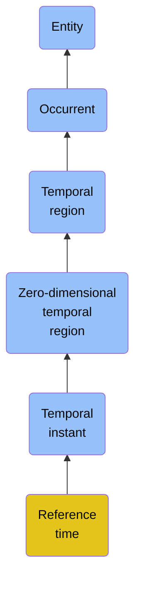

# Reference time

## Overview

### Definition
A Temporal Instant specified as the origin for which other Temporal Regions are measured or identified.

### Examples
Not defined.

### Aliases
- Epoch
- Reference Date
- Epoch Time

### URI
https://www.commoncoreontologies.org/ont00001116

### Subclass Of

- [Entity](/docs/ontology/reference/full/Entity/Entity.md)
- [Occurrent](/docs/ontology/reference/full/Entity/Occurrent/Occurrent.md)
- [Temporal region](/docs/ontology/reference/full/Entity/Occurrent/Temporal%20region/Temporal%20region.md)
- [Zero-dimensional temporal region](/docs/ontology/reference/full/Entity/Occurrent/Temporal%20region/Zero-dimensional%20temporal%20region/Zero-dimensional%20temporal%20region.md)
- [Temporal instant](/docs/ontology/reference/full/Entity/Occurrent/Temporal%20region/Zero-dimensional%20temporal%20region/Temporal%20instant/Temporal%20instant.md)
- [Reference time](/docs/ontology/reference/full/Entity/Occurrent/Temporal%20region/Zero-dimensional%20temporal%20region/Temporal%20instant/Reference%20time/Reference%20time.md)

### Ontology Reference
- [cco](https://www.commoncoreontologies.org/): [TimeOntology](https://www.commoncoreontologies.org/TimeOntology)

## Properties
### Data Properties
| Ontology | Label | Definition | Example | Domain | Range |
|----------|-------|------------|---------|--------|-------|
| abi | [is curated in foundry](http://ontology.naas.ai/abi/is_curated_in_foundry) | Relates a class to the foundry it is curated in. | The class cco:ont00001262 is curated in the foundry 'enterprise_management_foundry' and 'personal_ai_foundry'. | [entity](/docs/ontology/reference/full/Entity/Entity.md) | [string](http://www.w3.org/2001/XMLSchema#string) |
| abi | [data property](http://ontology.naas.ai/abi/template/dataProperty) | A data property is a property that is used to represent a data property. |  | [entity](/docs/ontology/reference/full/Entity/Entity.md) | [string](http://www.w3.org/2001/XMLSchema#string) |

### Object Properties
| Ontology | Label | Definition | Example | Domain | Range | Inverse Of |
|----------|-------|------------|---------|--------|-------|------------|
| abi | [has backing data source](http://ontology.naas.ai/abi/hasBackingDataSource) | Relates an entity to the data source that provides the underlying data for that entity. This property indicates the origin or source of the data that supports the entity. | A report entity may have a backing data source that provides the raw data used to generate the report. | [entity](/docs/ontology/reference/full/Entity/Entity.md) | [Data Source](/docs/ontology/reference/full/Entity/Continuant/Generically%20dependent%20continuant/Data%20source/Data%20source.md) |  |
| abi | [has template class](http://ontology.naas.ai/abi/template/hasTemplateClass) | Relates a subject to its template class. |  | [entity](/docs/ontology/reference/full/Entity/Entity.md) | [Template Class](/docs/ontology/reference/full/Entity/Continuant/Generically%20dependent%20continuant/Template%20class/Template%20class.md) |  |
| bfo | [exists at](http://purl.obolibrary.org/obo/BFO_0000108) | (Elucidation) exists at is a relation between a particular and some temporal region at which the particular exists | First World War exists at 1914-1916; Mexico exists at January 1, 2000 | [entity](/docs/ontology/reference/full/Entity/Entity.md) | [temporal region](/docs/ontology/reference/full/Entity/Occurrent/Temporal%20region/Temporal%20region.md) |  |
| bfo | [preceded by](http://purl.obolibrary.org/obo/BFO_0000062) | b preceded by c =Def b precedes c | The temporal region occupied by the second half of the match is preceded by the temporal region occupied by the first half of the match | [occurrent](/docs/ontology/reference/full/Entity/Occurrent/Occurrent.md) | [occurrent](/docs/ontology/reference/full/Entity/Occurrent/Occurrent.md) | [precedes](http://purl.obolibrary.org/obo/BFO_0000063) |
| bfo | [precedes](http://purl.obolibrary.org/obo/BFO_0000063) | (Elucidation) precedes is a relation between occurrents o, o' such that if t is the temporal extent of o & t' is the temporal extent of o' then either the last instant of o is before the first instant of o' or the last instant of o is the first instant of o' & neither o nor o' are temporal instants | The temporal region occupied by Mary's birth precedes the temporal region occupied by Mary's death. | [occurrent](/docs/ontology/reference/full/Entity/Occurrent/Occurrent.md) | [occurrent](/docs/ontology/reference/full/Entity/Occurrent/Occurrent.md) |  |
| bfo | [has occurrent part](http://purl.obolibrary.org/obo/BFO_0000117) | b has occurrent part c =Def c occurrent part of b | Mary's life has occurrent part Mary's 5th birthday | [occurrent](/docs/ontology/reference/full/Entity/Occurrent/Occurrent.md) | [occurrent](/docs/ontology/reference/full/Entity/Occurrent/Occurrent.md) | [occurrent part of](http://purl.obolibrary.org/obo/BFO_0000132) |
| bfo | [has temporal part](http://purl.obolibrary.org/obo/BFO_0000121) | b has temporal part c =Def c temporal part of b | Your life has temporal part the first year of your life | [occurrent](/docs/ontology/reference/full/Entity/Occurrent/Occurrent.md) | [occurrent](/docs/ontology/reference/full/Entity/Occurrent/Occurrent.md) | [temporal part of](http://purl.obolibrary.org/obo/BFO_0000139) |
| bfo | [occurrent part of](http://purl.obolibrary.org/obo/BFO_0000132) | (Elucidation) occurrent part of is a relation between occurrents b and c when b is part of c | Mary's 5th birthday is an occurrent part of Mary's life; the first set of the tennis match is an occurrent part of the tennis match | [occurrent](/docs/ontology/reference/full/Entity/Occurrent/Occurrent.md) | [occurrent](/docs/ontology/reference/full/Entity/Occurrent/Occurrent.md) |  |
| bfo | [temporal part of](http://purl.obolibrary.org/obo/BFO_0000139) | b temporal part of c =Def b occurrent part of c & (b and c are temporal regions) or (b and c are spatiotemporal regions & b temporally projects onto an occurrent part of the temporal region that c temporally projects onto) or (b and c are processes or process boundaries & b occupies a temporal region that is an occurrent part of the temporal region that c occupies) | Your heart beating from 4pm to 5pm today is a temporal part of the process of your heart beating; the 4th year of your life is a temporal part of your life, as is the process boundary which separates the 3rd and 4th years of your life; the first quarter of a game of football is a temporal part of the whole game | [occurrent](/docs/ontology/reference/full/Entity/Occurrent/Occurrent.md) | [occurrent](/docs/ontology/reference/full/Entity/Occurrent/Occurrent.md) |  |
| cco | [is cause of](https://www.commoncoreontologies.org/ont00001803) | x is_cause_of y iff x and y are instances of Occurrent, and y is a consequence of x. |  | [occurrent](/docs/ontology/reference/full/Entity/Occurrent/Occurrent.md) | [occurrent](/docs/ontology/reference/full/Entity/Occurrent/Occurrent.md) | [caused by](https://www.commoncoreontologies.org/ont00001819) |
| cco | [caused by](https://www.commoncoreontologies.org/ont00001819) | x caused_by y iff x and y are instances of Occurrent, and x is a consequence of y. |  | [occurrent](/docs/ontology/reference/full/Entity/Occurrent/Occurrent.md) | [occurrent](/docs/ontology/reference/full/Entity/Occurrent/Occurrent.md) |  |
| bfo | [has first instant](http://purl.obolibrary.org/obo/BFO_0000222) | t has first instant t' =Def t' first instant of t | The first hour of a year has first instant midnight on December 31 | [temporal region](/docs/ontology/reference/full/Entity/Occurrent/Temporal%20region/Temporal%20region.md) | [temporal instant](/docs/ontology/reference/full/Entity/Occurrent/Temporal%20region/Zero-dimensional%20temporal%20region/Temporal%20instant/Temporal%20instant.md) |  |
| bfo | [has last instant](http://purl.obolibrary.org/obo/BFO_0000224) | t has last instant t' =Def t' last instant of t | The last hour of a year has last instant midnight December 31 | [temporal region](/docs/ontology/reference/full/Entity/Occurrent/Temporal%20region/Temporal%20region.md) | [temporal instant](/docs/ontology/reference/full/Entity/Occurrent/Temporal%20region/Zero-dimensional%20temporal%20region/Temporal%20instant/Temporal%20instant.md) |  |
| cco | [is temporal region of](https://www.commoncoreontologies.org/ont00001874) | t is temporal region of p iff p occupies temporal region t. |  | [temporal region](/docs/ontology/reference/full/Entity/Occurrent/Temporal%20region/Temporal%20region.md) | [{'or': ['http://purl.obolibrary.org/obo/BFO_0000015', 'http://purl.obolibrary.org/obo/BFO_0000035']}](/docs/ontology/reference/full/%7B%27or%27%3A%20%5B%27http%3A//purl.obolibrary.org/obo/BFO_0000015%27%2C%20%27http%3A//purl.obolibrary.org/obo/BFO_0000035%27%5D%7D/%7B%27or%27%3A%20%5B%27http%3A//purl.obolibrary.org/obo/bfo_0000015%27%2C%20%27http%3A//purl.obolibrary.org/obo/bfo_0000035%27%5D%7D.md) |  |
| cco | [is inside instant of](https://www.commoncoreontologies.org/ont00001848) | For Temporal Instant t1 and Temporal Interval t2, t1 is inside instant of t2 if and only if there are Temporal Instants t3 and t4 non-identical to t1 and part of t2 such that t3 is before t1 and t4 is after t1. |  | [zero-dimensional temporal region](/docs/ontology/reference/full/Entity/Occurrent/Temporal%20region/Zero-dimensional%20temporal%20region/Zero-dimensional%20temporal%20region.md) | [one-dimensional temporal region](/docs/ontology/reference/full/Entity/Occurrent/Temporal%20region/One-dimensional%20temporal%20region/One-dimensional%20temporal%20region.md) |  |
| cco | [instant is after](https://www.commoncoreontologies.org/ont00001893) | A temporal instant t2 (a instance of a zero-dimensional temporal region) is after another temporal instant t1 iff there exists some instance of a temporal interval ti1 such that t1 is the starting instant of ti1 and t2 is the ending instant of ti1. |  | [zero-dimensional temporal region](/docs/ontology/reference/full/Entity/Occurrent/Temporal%20region/Zero-dimensional%20temporal%20region/Zero-dimensional%20temporal%20region.md) | [zero-dimensional temporal region](/docs/ontology/reference/full/Entity/Occurrent/Temporal%20region/Zero-dimensional%20temporal%20region/Zero-dimensional%20temporal%20region.md) | [instant is before](https://www.commoncoreontologies.org/ont00001990) |
| cco | [instant is before](https://www.commoncoreontologies.org/ont00001990) | A temporal instant t1 (a instance of a zero-dimensional temporal region) is before another temporal instant t2 iff there exists some instance of a temporal interval ti1 such that t1 is the starting instant of ti1 and t2 is the ending instant of ti1. |  | [zero-dimensional temporal region](/docs/ontology/reference/full/Entity/Occurrent/Temporal%20region/Zero-dimensional%20temporal%20region/Zero-dimensional%20temporal%20region.md) | [zero-dimensional temporal region](/docs/ontology/reference/full/Entity/Occurrent/Temporal%20region/Zero-dimensional%20temporal%20region/Zero-dimensional%20temporal%20region.md) |  |
| bfo | [first instant of](http://purl.obolibrary.org/obo/BFO_0000221) | t first instant of t' =Def t is a temporal instant & t' is a temporal region t' & t precedes all temporal parts of t' other than t | An hour starting at midnight yesterday has first instant midnight yesterday | [temporal instant](/docs/ontology/reference/full/Entity/Occurrent/Temporal%20region/Zero-dimensional%20temporal%20region/Temporal%20instant/Temporal%20instant.md) | [temporal region](/docs/ontology/reference/full/Entity/Occurrent/Temporal%20region/Temporal%20region.md) | [has first instant](http://purl.obolibrary.org/obo/BFO_0000222) |
| bfo | [last instant of](http://purl.obolibrary.org/obo/BFO_0000223) | t last instant of t' =Def t is a temporal instant & t' is a temporal region & all temporal parts of t' other than t precede t | Last midnight is the last instant of yesterday | [temporal instant](/docs/ontology/reference/full/Entity/Occurrent/Temporal%20region/Zero-dimensional%20temporal%20region/Temporal%20instant/Temporal%20instant.md) | [temporal region](/docs/ontology/reference/full/Entity/Occurrent/Temporal%20region/Temporal%20region.md) | [has last instant](http://purl.obolibrary.org/obo/BFO_0000224) |

