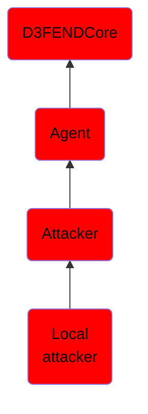

# Local attacker

## Overview

### Definition
An attacker who is physically near or on the premises of the target network or systems.

### Examples
Not defined.

### Aliases
Not defined.

### URI
http://d3fend.mitre.org/ontologies/d3fend.owl#LocalAttacker

### Subclass Of

- [D3FENDCore](/docs/ontology/reference/model/D3FENDCore/D3FENDCore.md)
- [Agent](/docs/ontology/reference/model/D3FENDCore/Agent/Agent.md)
- [Attacker](/docs/ontology/reference/model/D3FENDCore/Agent/Attacker/Attacker.md)
- [Local attacker](/docs/ontology/reference/model/D3FENDCore/Agent/Attacker/Local%20attacker/Local%20attacker.md)

### Ontology Reference
- [d3fend](http://d3fend.mitre.org/ontologies/d3fend.owl#)

## Properties
