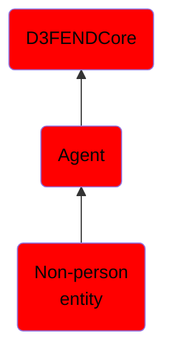

# Non-person entity

## Overview

### Definition
An entity related to information technology with a digital identity that acts in cyberspace, but is not a human actor. This can include organizations, hardware objects (physical entities/devices), software objects (virtual/logical entities), and information artifacts.

### Examples
Not defined.

### Aliases
Not defined.

### URI
http://d3fend.mitre.org/ontologies/d3fend.owl#Non-PersonEntity

### Subclass Of

- [D3FENDCore](/docs/ontology/reference/model/D3FENDCore/D3FENDCore.md)
- [Agent](/docs/ontology/reference/model/D3FENDCore/Agent/Agent.md)
- [Non-person entity](/docs/ontology/reference/model/D3FENDCore/Agent/Non-person%20entity/Non-person%20entity.md)

### Ontology Reference
- [d3fend](http://d3fend.mitre.org/ontologies/d3fend.owl#)

## Properties
