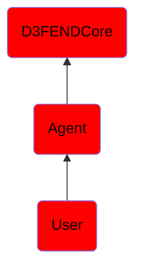

# User

## Overview

### Definition
A user is a person [or agent] who uses a computer or network service. Users generally use a system or a software product without the technical expertise required to fully understand it. Power users use advanced features of programs, though they are not necessarily capable of computer programming and system administration. A user often has a user account and is identified to the system by a username (or user name). Other terms for username include login name, screenname (or screen name), nickname (or nick) and handle, which is derived from the identical Citizen's Band radio term. Some software products provide services to other systems and have no direct end users.

### Examples
Not defined.

### Aliases
Not defined.

### URI
http://d3fend.mitre.org/ontologies/d3fend.owl#User

### Subclass Of

- [D3FENDCore](/docs/ontology/reference/model/D3FENDCore/D3FENDCore.md)
- [Agent](/docs/ontology/reference/model/D3FENDCore/Agent/Agent.md)
- [User](/docs/ontology/reference/model/D3FENDCore/Agent/User/User.md)

### Ontology Reference
- [d3fend](http://d3fend.mitre.org/ontologies/d3fend.owl#)

## Properties
