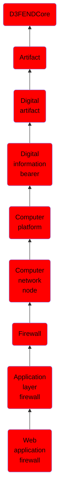

# Web application firewall

## Overview

### Definition
A web application firewall (or WAF) filters, monitors, and blocks HTTP traffic to and from a web application. A WAF is differentiated from a regular firewall in that a WAF is able to filter the content of specific web applications while regular firewalls serve as a safety gate between servers. By inspecting HTTP traffic, it can prevent attacks stemming from web application security flaws, such as SQL injection, cross-site scripting (XSS), file inclusion, and security misconfigurations.

### Examples
Not defined.

### Aliases
WAF

### URI
http://d3fend.mitre.org/ontologies/d3fend.owl#WebApplicationFirewall

### Subclass Of

- [D3FENDCore](/docs/ontology/reference/model/D3FENDCore/D3FENDCore.md)
- [Artifact](/docs/ontology/reference/model/D3FENDCore/Artifact/Artifact.md)
- [Digital artifact](/docs/ontology/reference/model/D3FENDCore/Artifact/Digital%20artifact/Digital%20artifact.md)
- [Digital information bearer](/docs/ontology/reference/model/D3FENDCore/Artifact/Digital%20artifact/Digital%20information%20bearer/Digital%20information%20bearer.md)
- [Computer platform](/docs/ontology/reference/model/D3FENDCore/Artifact/Digital%20artifact/Digital%20information%20bearer/Computer%20platform/Computer%20platform.md)
- [Computer network node](/docs/ontology/reference/model/D3FENDCore/Artifact/Digital%20artifact/Digital%20information%20bearer/Computer%20platform/Computer%20network%20node/Computer%20network%20node.md)
- [Firewall](/docs/ontology/reference/model/D3FENDCore/Artifact/Digital%20artifact/Digital%20information%20bearer/Computer%20platform/Computer%20network%20node/Firewall/Firewall.md)
- [Application layer firewall](/docs/ontology/reference/model/D3FENDCore/Artifact/Digital%20artifact/Digital%20information%20bearer/Computer%20platform/Computer%20network%20node/Firewall/Application%20layer%20firewall/Application%20layer%20firewall.md)
- [Web application firewall](/docs/ontology/reference/model/D3FENDCore/Artifact/Digital%20artifact/Digital%20information%20bearer/Computer%20platform/Computer%20network%20node/Firewall/Application%20layer%20firewall/Web%20application%20firewall/Web%20application%20firewall.md)

### Ontology Reference
- [d3fend](http://d3fend.mitre.org/ontologies/d3fend.owl#)

## Properties
### Data Properties
| Ontology | Label | Definition | Example | Domain | Range |
|----------|-------|------------|---------|--------|-------|
| d3fend | [d3fend-artifact-data-property](http://d3fend.mitre.org/ontologies/d3fend.owl#d3fend-artifact-data-property) | x d3fend-artifact-data-property y: The artifact x has the data property y. |  | [Digital Artifact](/docs/ontology/reference/model/D3FENDCore/Artifact/Digital%20artifact/Digital%20artifact.md) |  |

### Object Properties
| Ontology | Label | Definition | Example | Domain | Range | Inverse Of |
|----------|-------|------------|---------|--------|-------|------------|
| d3fend | [may-have-weakness](http://d3fend.mitre.org/ontologies/d3fend.owl#may-have-weakness) |  |  | [Artifact](/docs/ontology/reference/model/D3FENDCore/Artifact/Artifact.md) | [Weakness](/docs/ontology/reference/model/D3FENDCore/Weakness/Weakness.md) |  |

