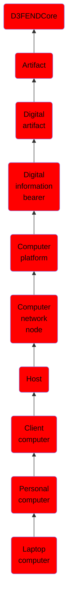

# Laptop computer

## Overview

### Definition
A laptop computer (also laptop), is a small, portable personal computer (PC) with a "clamshell" form factor, typically having a thin LCD or LED computer screen mounted on the inside of the upper lid of the clamshell and an alphanumeric keyboard on the inside of the lower lid. The clamshell is opened up to use the computer. Laptops are folded shut for transportation, and thus are suitable for mobile use. Its name comes from lap, as it was deemed to be placed on a person's lap when being used. Although originally there was a distinction between laptops and notebooks (the former being bigger and heavier than the latter), as of 2014, there is often no longer any difference. Today, laptops are commonly used in a variety of settings, such as at work, in education, for playing games, web browsing

### Examples
Not defined.

### Aliases
- Notebook
- Laptop

### URI
http://d3fend.mitre.org/ontologies/d3fend.owl#LaptopComputer

### Subclass Of

- [D3FENDCore](/docs/ontology/reference/model/D3FENDCore/D3FENDCore.md)
- [Artifact](/docs/ontology/reference/model/D3FENDCore/Artifact/Artifact.md)
- [Digital artifact](/docs/ontology/reference/model/D3FENDCore/Artifact/Digital%20artifact/Digital%20artifact.md)
- [Digital information bearer](/docs/ontology/reference/model/D3FENDCore/Artifact/Digital%20artifact/Digital%20information%20bearer/Digital%20information%20bearer.md)
- [Computer platform](/docs/ontology/reference/model/D3FENDCore/Artifact/Digital%20artifact/Digital%20information%20bearer/Computer%20platform/Computer%20platform.md)
- [Computer network node](/docs/ontology/reference/model/D3FENDCore/Artifact/Digital%20artifact/Digital%20information%20bearer/Computer%20platform/Computer%20network%20node/Computer%20network%20node.md)
- [Host](/docs/ontology/reference/model/D3FENDCore/Artifact/Digital%20artifact/Digital%20information%20bearer/Computer%20platform/Computer%20network%20node/Host/Host.md)
- [Client computer](/docs/ontology/reference/model/D3FENDCore/Artifact/Digital%20artifact/Digital%20information%20bearer/Computer%20platform/Computer%20network%20node/Host/Client%20computer/Client%20computer.md)
- [Personal computer](/docs/ontology/reference/model/D3FENDCore/Artifact/Digital%20artifact/Digital%20information%20bearer/Computer%20platform/Computer%20network%20node/Host/Client%20computer/Personal%20computer/Personal%20computer.md)
- [Laptop computer](/docs/ontology/reference/model/D3FENDCore/Artifact/Digital%20artifact/Digital%20information%20bearer/Computer%20platform/Computer%20network%20node/Host/Client%20computer/Personal%20computer/Laptop%20computer/Laptop%20computer.md)

### Ontology Reference
- [d3fend](http://d3fend.mitre.org/ontologies/d3fend.owl#)

## Properties
### Data Properties
| Ontology | Label | Definition | Example | Domain | Range |
|----------|-------|------------|---------|--------|-------|
| d3fend | [d3fend-artifact-data-property](http://d3fend.mitre.org/ontologies/d3fend.owl#d3fend-artifact-data-property) | x d3fend-artifact-data-property y: The artifact x has the data property y. |  | [Digital Artifact](/docs/ontology/reference/model/D3FENDCore/Artifact/Digital%20artifact/Digital%20artifact.md) |  |

### Object Properties
| Ontology | Label | Definition | Example | Domain | Range | Inverse Of |
|----------|-------|------------|---------|--------|-------|------------|
| d3fend | [may-have-weakness](http://d3fend.mitre.org/ontologies/d3fend.owl#may-have-weakness) |  |  | [Artifact](/docs/ontology/reference/model/D3FENDCore/Artifact/Artifact.md) | [Weakness](/docs/ontology/reference/model/D3FENDCore/Weakness/Weakness.md) |  |

