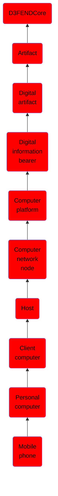

# Mobile phone

## Overview

### Definition
A mobile phone, cellular phone, cell phone, cellphone or hand phone, sometimes shortened to simply mobile, cell or just phone, is a portable telephone that can make and receive calls over a radio frequency link while the user is moving within a telephone service area. The radio frequency link establishes a connection to the switching systems of a mobile phone operator, which provides access to the public switched telephone network (PSTN). Modern mobile telephone services use a cellular network architecture and, therefore, mobile telephones are called cellular telephones or cell phones in North America. In addition to telephony, digital mobile phones (2G) support a variety of other services, such as text messaging, MMS, email, Internet access, short-range wireless communications (infrared,

### Examples
Not defined.

### Aliases
- Cellphone
- Cellular Phone

### URI
http://d3fend.mitre.org/ontologies/d3fend.owl#MobilePhone

### Subclass Of

- [D3FENDCore](/docs/ontology/reference/model/D3FENDCore/D3FENDCore.md)
- [Artifact](/docs/ontology/reference/model/D3FENDCore/Artifact/Artifact.md)
- [Digital artifact](/docs/ontology/reference/model/D3FENDCore/Artifact/Digital%20artifact/Digital%20artifact.md)
- [Digital information bearer](/docs/ontology/reference/model/D3FENDCore/Artifact/Digital%20artifact/Digital%20information%20bearer/Digital%20information%20bearer.md)
- [Computer platform](/docs/ontology/reference/model/D3FENDCore/Artifact/Digital%20artifact/Digital%20information%20bearer/Computer%20platform/Computer%20platform.md)
- [Computer network node](/docs/ontology/reference/model/D3FENDCore/Artifact/Digital%20artifact/Digital%20information%20bearer/Computer%20platform/Computer%20network%20node/Computer%20network%20node.md)
- [Host](/docs/ontology/reference/model/D3FENDCore/Artifact/Digital%20artifact/Digital%20information%20bearer/Computer%20platform/Computer%20network%20node/Host/Host.md)
- [Client computer](/docs/ontology/reference/model/D3FENDCore/Artifact/Digital%20artifact/Digital%20information%20bearer/Computer%20platform/Computer%20network%20node/Host/Client%20computer/Client%20computer.md)
- [Personal computer](/docs/ontology/reference/model/D3FENDCore/Artifact/Digital%20artifact/Digital%20information%20bearer/Computer%20platform/Computer%20network%20node/Host/Client%20computer/Personal%20computer/Personal%20computer.md)
- [Mobile phone](/docs/ontology/reference/model/D3FENDCore/Artifact/Digital%20artifact/Digital%20information%20bearer/Computer%20platform/Computer%20network%20node/Host/Client%20computer/Personal%20computer/Mobile%20phone/Mobile%20phone.md)

### Ontology Reference
- [d3fend](http://d3fend.mitre.org/ontologies/d3fend.owl#)

## Properties
### Data Properties
| Ontology | Label | Definition | Example | Domain | Range |
|----------|-------|------------|---------|--------|-------|
| d3fend | [d3fend-artifact-data-property](http://d3fend.mitre.org/ontologies/d3fend.owl#d3fend-artifact-data-property) | x d3fend-artifact-data-property y: The artifact x has the data property y. |  | [Digital Artifact](/docs/ontology/reference/model/D3FENDCore/Artifact/Digital%20artifact/Digital%20artifact.md) |  |

### Object Properties
| Ontology | Label | Definition | Example | Domain | Range | Inverse Of |
|----------|-------|------------|---------|--------|-------|------------|
| d3fend | [may-have-weakness](http://d3fend.mitre.org/ontologies/d3fend.owl#may-have-weakness) |  |  | [Artifact](/docs/ontology/reference/model/D3FENDCore/Artifact/Artifact.md) | [Weakness](/docs/ontology/reference/model/D3FENDCore/Weakness/Weakness.md) |  |

