# Outbound internet encrypted remote terminal traffic

## Overview

### Definition
Outbound internet encrypted remote terminal traffic is encrypted network traffic for a standard remote terminal protocol on an outgoing connection initiated from a host within a network to a host outside the network.

### Examples
Not defined.

### Aliases
- Outbound Internet Encrypted SSH Traffic
- Outbound Internet Encrypted RDP Traffic

### URI
http://d3fend.mitre.org/ontologies/d3fend.owl#OutboundInternetEncryptedRemoteTerminalTraffic

### Subclass Of

```mermaid
graph BT
    d3fend.owl#OutboundInternetEncryptedRemoteTerminalTraffic(Outbound<br>internet<br>encrypted<br>remote<br>terminal<br>traffic):::d3fend-->d3fend.owl#OutboundInternetEncryptedTraffic
    d3fend.owl#OutboundInternetEncryptedTraffic(Outbound<br>internet<br>encrypted<br>traffic):::d3fend-->d3fend.owl#OutboundInternetNetworkTraffic
    d3fend.owl#OutboundInternetNetworkTraffic(Outbound<br>internet<br>network<br>traffic):::d3fend-->d3fend.owl#OutboundNetworkTraffic
    d3fend.owl#OutboundNetworkTraffic(Outbound<br>network<br>traffic):::d3fend-->d3fend.owl#NetworkTraffic
    d3fend.owl#NetworkTraffic(Network<br>traffic):::d3fend-->d3fend.owl#DigitalInformationBearer
    d3fend.owl#DigitalInformationBearer(Digital<br>information<br>bearer):::d3fend-->d3fend.owl#DigitalArtifact
    d3fend.owl#DigitalArtifact(Digital<br>artifact):::d3fend-->d3fend.owl#Artifact
    d3fend.owl#Artifact(Artifact):::d3fend-->d3fend.owl#D3FENDCore
    d3fend.owl#D3FENDCore(D3FENDCore):::d3fend
    
    classDef bfo fill:#97c1fb,color:#060606
    classDef cco fill:#e4c51e,color:#060606
    classDef abi fill:#48DD82,color:#060606
    classDef attack fill:#FF0000,color:#060606
    classDef d3fend fill:#FF0000,color:#060606
```

- [D3FENDCore](/docs/ontology/reference/model/D3FENDCore/D3FENDCore.md)
- [Artifact](/docs/ontology/reference/model/D3FENDCore/Artifact/Artifact.md)
- [Digital artifact](/docs/ontology/reference/model/D3FENDCore/Artifact/Digital%20artifact/Digital%20artifact.md)
- [Digital information bearer](/docs/ontology/reference/model/D3FENDCore/Artifact/Digital%20artifact/Digital%20information%20bearer/Digital%20information%20bearer.md)
- [Network traffic](/docs/ontology/reference/model/D3FENDCore/Artifact/Digital%20artifact/Digital%20information%20bearer/Network%20traffic/Network%20traffic.md)
- [Outbound network traffic](/docs/ontology/reference/model/D3FENDCore/Artifact/Digital%20artifact/Digital%20information%20bearer/Network%20traffic/Outbound%20network%20traffic/Outbound%20network%20traffic.md)
- [Outbound internet network traffic](/docs/ontology/reference/model/D3FENDCore/Artifact/Digital%20artifact/Digital%20information%20bearer/Network%20traffic/Outbound%20network%20traffic/Outbound%20internet%20network%20traffic/Outbound%20internet%20network%20traffic.md)
- [Outbound internet encrypted traffic](/docs/ontology/reference/model/D3FENDCore/Artifact/Digital%20artifact/Digital%20information%20bearer/Network%20traffic/Outbound%20network%20traffic/Outbound%20internet%20network%20traffic/Outbound%20internet%20encrypted%20traffic/Outbound%20internet%20encrypted%20traffic.md)
- [Outbound internet encrypted remote terminal traffic](/docs/ontology/reference/model/D3FENDCore/Artifact/Digital%20artifact/Digital%20information%20bearer/Network%20traffic/Outbound%20network%20traffic/Outbound%20internet%20network%20traffic/Outbound%20internet%20encrypted%20traffic/Outbound%20internet%20encrypted%20remote%20terminal%20traffic/Outbound%20internet%20encrypted%20remote%20terminal%20traffic.md)

### Ontology Reference
- [d3fend](http://d3fend.mitre.org/ontologies/d3fend.owl#)

## Properties
### Data Properties
| Ontology | Label | Definition | Example | Domain | Range |
|----------|-------|------------|---------|--------|-------|
| d3fend | [d3fend-artifact-data-property](http://d3fend.mitre.org/ontologies/d3fend.owl#d3fend-artifact-data-property) | x d3fend-artifact-data-property y: The artifact x has the data property y. |  | [Digital Artifact](/docs/ontology/reference/model/D3FENDCore/Artifact/Digital%20artifact/Digital%20artifact.md) |  |

### Object Properties
| Ontology | Label | Definition | Example | Domain | Range | Inverse Of |
|----------|-------|------------|---------|--------|-------|------------|
| d3fend | [may-have-weakness](http://d3fend.mitre.org/ontologies/d3fend.owl#may-have-weakness) |  |  | [Artifact](/docs/ontology/reference/model/D3FENDCore/Artifact/Artifact.md) | [Weakness](/docs/ontology/reference/model/D3FENDCore/Weakness/Weakness.md) |  |

