# Barcode scanner input device

## Overview

### Definition
A barcode reader (or barcode scanner) is an optical scanner that can read printed barcodes, decode the data contained in the barcode and send the data to a computer. Like a flatbed scanner, it consists of a light source, a lens and a light sensor translating for optical impulses into electrical signals. Additionally, nearly all barcode readers contain decoder circuitry that can analyze the barcode's image data provided by the sensor and sending the barcode's content to the scanner's output port.

### Examples
Not defined.

### Aliases
Barcode Reader

### URI
http://d3fend.mitre.org/ontologies/d3fend.owl#BarcodeScannerInputDevice

### Subclass Of

```mermaid
graph BT
    d3fend.owl#BarcodeScannerInputDevice(Barcode<br>scanner<br>input<br>device):::d3fend-->d3fend.owl#ImageScannerInputDevice
    d3fend.owl#ImageScannerInputDevice(Image<br>scanner<br>input<br>device):::d3fend-->d3fend.owl#VideoInputDevice
    d3fend.owl#VideoInputDevice(Video<br>input<br>device):::d3fend-->d3fend.owl#InputDevice
    d3fend.owl#InputDevice(Input<br>device):::d3fend-->d3fend.owl#LocalResource
    d3fend.owl#LocalResource(Local<br>resource):::d3fend-->d3fend.owl#Resource
    d3fend.owl#Resource(Resource):::d3fend-->d3fend.owl#DigitalInformationBearer
    d3fend.owl#DigitalInformationBearer(Digital<br>information<br>bearer):::d3fend-->d3fend.owl#DigitalArtifact
    d3fend.owl#DigitalArtifact(Digital<br>artifact):::d3fend-->d3fend.owl#Artifact
    d3fend.owl#Artifact(Artifact):::d3fend-->d3fend.owl#D3FENDCore
    d3fend.owl#D3FENDCore(D3FENDCore):::d3fend
    
    classDef bfo fill:#97c1fb,color:#060606
    classDef cco fill:#e4c51e,color:#060606
    classDef abi fill:#48DD82,color:#060606
    classDef attack fill:#FF0000,color:#060606
    classDef d3fend fill:#FF0000,color:#060606
```

- [D3FENDCore](/docs/ontology/reference/model/D3FENDCore/D3FENDCore.md)
- [Artifact](/docs/ontology/reference/model/D3FENDCore/Artifact/Artifact.md)
- [Digital artifact](/docs/ontology/reference/model/D3FENDCore/Artifact/Digital%20artifact/Digital%20artifact.md)
- [Digital information bearer](/docs/ontology/reference/model/D3FENDCore/Artifact/Digital%20artifact/Digital%20information%20bearer/Digital%20information%20bearer.md)
- [Resource](/docs/ontology/reference/model/D3FENDCore/Artifact/Digital%20artifact/Digital%20information%20bearer/Resource/Resource.md)
- [Local resource](/docs/ontology/reference/model/D3FENDCore/Artifact/Digital%20artifact/Digital%20information%20bearer/Resource/Local%20resource/Local%20resource.md)
- [Input device](/docs/ontology/reference/model/D3FENDCore/Artifact/Digital%20artifact/Digital%20information%20bearer/Resource/Local%20resource/Input%20device/Input%20device.md)
- [Video input device](/docs/ontology/reference/model/D3FENDCore/Artifact/Digital%20artifact/Digital%20information%20bearer/Resource/Local%20resource/Input%20device/Video%20input%20device/Video%20input%20device.md)
- [Image scanner input device](/docs/ontology/reference/model/D3FENDCore/Artifact/Digital%20artifact/Digital%20information%20bearer/Resource/Local%20resource/Input%20device/Video%20input%20device/Image%20scanner%20input%20device/Image%20scanner%20input%20device.md)
- [Barcode scanner input device](/docs/ontology/reference/model/D3FENDCore/Artifact/Digital%20artifact/Digital%20information%20bearer/Resource/Local%20resource/Input%20device/Video%20input%20device/Image%20scanner%20input%20device/Barcode%20scanner%20input%20device/Barcode%20scanner%20input%20device.md)

### Ontology Reference
- [d3fend](http://d3fend.mitre.org/ontologies/d3fend.owl#)

## Properties
### Data Properties
| Ontology | Label | Definition | Example | Domain | Range |
|----------|-------|------------|---------|--------|-------|
| d3fend | [d3fend-artifact-data-property](http://d3fend.mitre.org/ontologies/d3fend.owl#d3fend-artifact-data-property) | x d3fend-artifact-data-property y: The artifact x has the data property y. |  | [Digital Artifact](/docs/ontology/reference/model/D3FENDCore/Artifact/Digital%20artifact/Digital%20artifact.md) |  |

### Object Properties
| Ontology | Label | Definition | Example | Domain | Range | Inverse Of |
|----------|-------|------------|---------|--------|-------|------------|
| d3fend | [may-have-weakness](http://d3fend.mitre.org/ontologies/d3fend.owl#may-have-weakness) |  |  | [Artifact](/docs/ontology/reference/model/D3FENDCore/Artifact/Artifact.md) | [Weakness](/docs/ontology/reference/model/D3FENDCore/Weakness/Weakness.md) |  |

