# Finger print scanner input device

## Overview

### Definition
A fingerprint sensor is an electronic device used to capture a digital image of the fingerprint pattern. The captured image is called a live scan. This live scan is digitally processed to create a biometric template (a collection of extracted features) which is stored and used for matching. Many technologies have been used including optical, capacitive, RF, thermal, piezoresistive, ultrasonic, piezoelectric, and MEMS.

### Examples
Not defined.

### Aliases
Fingerprint Sensor

### URI
http://d3fend.mitre.org/ontologies/d3fend.owl#FingerPrintScannerInputDevice

### Subclass Of

```mermaid
graph BT
    d3fend.owl#FingerPrintScannerInputDevice(Finger<br>print<br>scanner<br>input<br>device):::d3fend-->d3fend.owl#ImageScannerInputDevice
    d3fend.owl#ImageScannerInputDevice(Image<br>scanner<br>input<br>device):::d3fend-->d3fend.owl#VideoInputDevice
    d3fend.owl#VideoInputDevice(Video<br>input<br>device):::d3fend-->d3fend.owl#InputDevice
    d3fend.owl#InputDevice(Input<br>device):::d3fend-->d3fend.owl#LocalResource
    d3fend.owl#LocalResource(Local<br>resource):::d3fend-->d3fend.owl#Resource
    d3fend.owl#Resource(Resource):::d3fend-->d3fend.owl#DigitalInformationBearer
    d3fend.owl#DigitalInformationBearer(Digital<br>information<br>bearer):::d3fend-->d3fend.owl#DigitalArtifact
    d3fend.owl#DigitalArtifact(Digital<br>artifact):::d3fend-->d3fend.owl#Artifact
    d3fend.owl#Artifact(Artifact):::d3fend-->d3fend.owl#D3FENDCore
    d3fend.owl#D3FENDCore(D3FENDCore):::d3fend
    
    classDef bfo fill:#97c1fb,color:#060606
    classDef cco fill:#e4c51e,color:#060606
    classDef abi fill:#48DD82,color:#060606
    classDef attack fill:#FF0000,color:#060606
    classDef d3fend fill:#FF0000,color:#060606
```

- [D3FENDCore](/docs/ontology/reference/model/D3FENDCore/D3FENDCore.md)
- [Artifact](/docs/ontology/reference/model/D3FENDCore/Artifact/Artifact.md)
- [Digital artifact](/docs/ontology/reference/model/D3FENDCore/Artifact/Digital%20artifact/Digital%20artifact.md)
- [Digital information bearer](/docs/ontology/reference/model/D3FENDCore/Artifact/Digital%20artifact/Digital%20information%20bearer/Digital%20information%20bearer.md)
- [Resource](/docs/ontology/reference/model/D3FENDCore/Artifact/Digital%20artifact/Digital%20information%20bearer/Resource/Resource.md)
- [Local resource](/docs/ontology/reference/model/D3FENDCore/Artifact/Digital%20artifact/Digital%20information%20bearer/Resource/Local%20resource/Local%20resource.md)
- [Input device](/docs/ontology/reference/model/D3FENDCore/Artifact/Digital%20artifact/Digital%20information%20bearer/Resource/Local%20resource/Input%20device/Input%20device.md)
- [Video input device](/docs/ontology/reference/model/D3FENDCore/Artifact/Digital%20artifact/Digital%20information%20bearer/Resource/Local%20resource/Input%20device/Video%20input%20device/Video%20input%20device.md)
- [Image scanner input device](/docs/ontology/reference/model/D3FENDCore/Artifact/Digital%20artifact/Digital%20information%20bearer/Resource/Local%20resource/Input%20device/Video%20input%20device/Image%20scanner%20input%20device/Image%20scanner%20input%20device.md)
- [Finger print scanner input device](/docs/ontology/reference/model/D3FENDCore/Artifact/Digital%20artifact/Digital%20information%20bearer/Resource/Local%20resource/Input%20device/Video%20input%20device/Image%20scanner%20input%20device/Finger%20print%20scanner%20input%20device/Finger%20print%20scanner%20input%20device.md)

### Ontology Reference
- [d3fend](http://d3fend.mitre.org/ontologies/d3fend.owl#)

## Properties
### Data Properties
| Ontology | Label | Definition | Example | Domain | Range |
|----------|-------|------------|---------|--------|-------|
| d3fend | [d3fend-artifact-data-property](http://d3fend.mitre.org/ontologies/d3fend.owl#d3fend-artifact-data-property) | x d3fend-artifact-data-property y: The artifact x has the data property y. |  | [Digital Artifact](/docs/ontology/reference/model/D3FENDCore/Artifact/Digital%20artifact/Digital%20artifact.md) |  |

### Object Properties
| Ontology | Label | Definition | Example | Domain | Range | Inverse Of |
|----------|-------|------------|---------|--------|-------|------------|
| d3fend | [may-have-weakness](http://d3fend.mitre.org/ontologies/d3fend.owl#may-have-weakness) |  |  | [Artifact](/docs/ontology/reference/model/D3FENDCore/Artifact/Artifact.md) | [Weakness](/docs/ontology/reference/model/D3FENDCore/Weakness/Weakness.md) |  |

