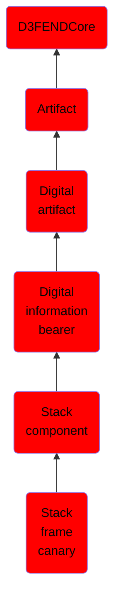

# Stack frame canary

## Overview

### Definition
Stack canaries, named for their analogy to a canary in a coal mine, are used to detect a stack buffer overflow before execution of malicious code can occur. This method works by placing a small integer, the value of which is randomly chosen at program start, in memory just before the stack return pointer. Most buffer overflows overwrite memory from lower to higher memory addresses, so in order to overwrite the return pointer (and thus take control of the process) the canary value must also be overwritten. This value is checked to make sure it has not changed before a routine uses the return pointer on the stack. This technique can greatly increase the difficulty of exploiting a stack buffer overflow because it forces the attacker to gain control of the instruction pointer by some non-traditional means such as corrupting other important variables on the stack.

### Examples
Not defined.

### Aliases
Stack Canary

### URI
http://d3fend.mitre.org/ontologies/d3fend.owl#StackFrameCanary

### Subclass Of

- [D3FENDCore](/docs/ontology/reference/model/D3FENDCore/D3FENDCore.md)
- [Artifact](/docs/ontology/reference/model/D3FENDCore/Artifact/Artifact.md)
- [Digital artifact](/docs/ontology/reference/model/D3FENDCore/Artifact/Digital%20artifact/Digital%20artifact.md)
- [Digital information bearer](/docs/ontology/reference/model/D3FENDCore/Artifact/Digital%20artifact/Digital%20information%20bearer/Digital%20information%20bearer.md)
- [Stack component](/docs/ontology/reference/model/D3FENDCore/Artifact/Digital%20artifact/Digital%20information%20bearer/Stack%20component/Stack%20component.md)
- [Stack frame canary](/docs/ontology/reference/model/D3FENDCore/Artifact/Digital%20artifact/Digital%20information%20bearer/Stack%20component/Stack%20frame%20canary/Stack%20frame%20canary.md)

### Ontology Reference
- [d3fend](http://d3fend.mitre.org/ontologies/d3fend.owl#)

## Properties
### Data Properties
| Ontology | Label | Definition | Example | Domain | Range |
|----------|-------|------------|---------|--------|-------|
| d3fend | [d3fend-artifact-data-property](http://d3fend.mitre.org/ontologies/d3fend.owl#d3fend-artifact-data-property) | x d3fend-artifact-data-property y: The artifact x has the data property y. |  | [Digital Artifact](/docs/ontology/reference/model/D3FENDCore/Artifact/Digital%20artifact/Digital%20artifact.md) |  |

### Object Properties
| Ontology | Label | Definition | Example | Domain | Range | Inverse Of |
|----------|-------|------------|---------|--------|-------|------------|
| d3fend | [may-have-weakness](http://d3fend.mitre.org/ontologies/d3fend.owl#may-have-weakness) |  |  | [Artifact](/docs/ontology/reference/model/D3FENDCore/Artifact/Artifact.md) | [Weakness](/docs/ontology/reference/model/D3FENDCore/Weakness/Weakness.md) |  |

