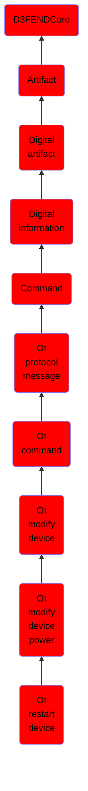

# Ot restart device

## Overview

### Definition
Modifies the power state of a device causing to to shut down and then reboot.

### Examples
Not defined.

### Aliases
Not defined.

### URI
http://d3fend.mitre.org/ontologies/d3fend.owl#OTRestartDevice

### Subclass Of

- [D3FENDCore](/docs/ontology/reference/model/D3FENDCore/D3FENDCore.md)
- [Artifact](/docs/ontology/reference/model/D3FENDCore/Artifact/Artifact.md)
- [Digital artifact](/docs/ontology/reference/model/D3FENDCore/Artifact/Digital%20artifact/Digital%20artifact.md)
- [Digital information](/docs/ontology/reference/model/D3FENDCore/Artifact/Digital%20artifact/Digital%20information/Digital%20information.md)
- [Command](/docs/ontology/reference/model/D3FENDCore/Artifact/Digital%20artifact/Digital%20information/Command/Command.md)
- [Ot protocol message](/docs/ontology/reference/model/D3FENDCore/Artifact/Digital%20artifact/Digital%20information/Command/Ot%20protocol%20message/Ot%20protocol%20message.md)
- [Ot command](/docs/ontology/reference/model/D3FENDCore/Artifact/Digital%20artifact/Digital%20information/Command/Ot%20protocol%20message/Ot%20command/Ot%20command.md)
- [Ot modify device](/docs/ontology/reference/model/D3FENDCore/Artifact/Digital%20artifact/Digital%20information/Command/Ot%20protocol%20message/Ot%20command/Ot%20modify%20device/Ot%20modify%20device.md)
- [Ot modify device power](/docs/ontology/reference/model/D3FENDCore/Artifact/Digital%20artifact/Digital%20information/Command/Ot%20protocol%20message/Ot%20command/Ot%20modify%20device/Ot%20modify%20device%20power/Ot%20modify%20device%20power.md)
- [Ot restart device](/docs/ontology/reference/model/D3FENDCore/Artifact/Digital%20artifact/Digital%20information/Command/Ot%20protocol%20message/Ot%20command/Ot%20modify%20device/Ot%20modify%20device%20power/Ot%20restart%20device/Ot%20restart%20device.md)

### Ontology Reference
- [d3fend](http://d3fend.mitre.org/ontologies/d3fend.owl#)

## Properties
### Data Properties
| Ontology | Label | Definition | Example | Domain | Range |
|----------|-------|------------|---------|--------|-------|
| d3fend | [d3fend-artifact-data-property](http://d3fend.mitre.org/ontologies/d3fend.owl#d3fend-artifact-data-property) | x d3fend-artifact-data-property y: The artifact x has the data property y. |  | [Digital Artifact](/docs/ontology/reference/model/D3FENDCore/Artifact/Digital%20artifact/Digital%20artifact.md) |  |

### Object Properties
| Ontology | Label | Definition | Example | Domain | Range | Inverse Of |
|----------|-------|------------|---------|--------|-------|------------|
| d3fend | [may-have-weakness](http://d3fend.mitre.org/ontologies/d3fend.owl#may-have-weakness) |  |  | [Artifact](/docs/ontology/reference/model/D3FENDCore/Artifact/Artifact.md) | [Weakness](/docs/ontology/reference/model/D3FENDCore/Weakness/Weakness.md) |  |

