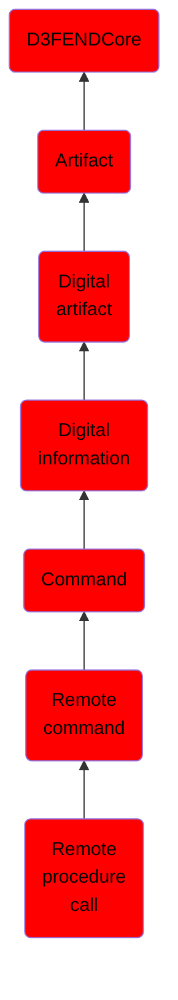

# Remote procedure call

## Overview

### Definition
In distributed computing a remote procedure call (RPC) is when a computer program causes a procedure (subroutine) to execute in another address space (commonly on another computer on a shared network), which is coded as if it were a normal (local) procedure call, without the programmer explicitly coding the details for the remote interaction. That is, the programmer writes essentially the same code whether the subroutine is local to the executing program, or remote. This is a form of client-server interaction (caller is client, executor is server), typically implemented via a request-response message-passing system. The object-oriented programming analog is remote method invocation (RMI). The RPC model implies a level of location transparency.

### Examples
Not defined.

### Aliases
Not defined.

### URI
http://d3fend.mitre.org/ontologies/d3fend.owl#RemoteProcedureCall

### Subclass Of

- [D3FENDCore](/docs/ontology/reference/model/D3FENDCore/D3FENDCore.md)
- [Artifact](/docs/ontology/reference/model/D3FENDCore/Artifact/Artifact.md)
- [Digital artifact](/docs/ontology/reference/model/D3FENDCore/Artifact/Digital%20artifact/Digital%20artifact.md)
- [Digital information](/docs/ontology/reference/model/D3FENDCore/Artifact/Digital%20artifact/Digital%20information/Digital%20information.md)
- [Command](/docs/ontology/reference/model/D3FENDCore/Artifact/Digital%20artifact/Digital%20information/Command/Command.md)
- [Remote command](/docs/ontology/reference/model/D3FENDCore/Artifact/Digital%20artifact/Digital%20information/Command/Remote%20command/Remote%20command.md)
- [Remote procedure call](/docs/ontology/reference/model/D3FENDCore/Artifact/Digital%20artifact/Digital%20information/Command/Remote%20command/Remote%20procedure%20call/Remote%20procedure%20call.md)

### Ontology Reference
- [d3fend](http://d3fend.mitre.org/ontologies/d3fend.owl#)

## Properties
### Data Properties
| Ontology | Label | Definition | Example | Domain | Range |
|----------|-------|------------|---------|--------|-------|
| d3fend | [d3fend-artifact-data-property](http://d3fend.mitre.org/ontologies/d3fend.owl#d3fend-artifact-data-property) | x d3fend-artifact-data-property y: The artifact x has the data property y. |  | [Digital Artifact](/docs/ontology/reference/model/D3FENDCore/Artifact/Digital%20artifact/Digital%20artifact.md) |  |

### Object Properties
| Ontology | Label | Definition | Example | Domain | Range | Inverse Of |
|----------|-------|------------|---------|--------|-------|------------|
| d3fend | [may-have-weakness](http://d3fend.mitre.org/ontologies/d3fend.owl#may-have-weakness) |  |  | [Artifact](/docs/ontology/reference/model/D3FENDCore/Artifact/Artifact.md) | [Weakness](/docs/ontology/reference/model/D3FENDCore/Weakness/Weakness.md) |  |

