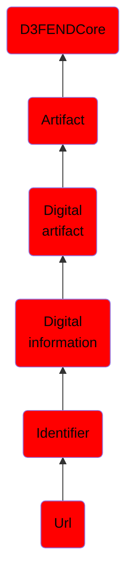

# Url

## Overview

### Definition
A Uniform Resource Locator (URL), commonly informally termed a web address (a term which is not defined identically) is a reference to a web resource that specifies its location on a computer network and a mechanism for retrieving it.A URL is a specific type of Uniform Resource Identifier (URI), although many people use the two terms interchangeably. A URL implies the means to access an indicated resource, which is not true of every URI. URLs occur most commonly to reference web pages (http), but are also used for file transfer (ftp), email (mailto), database access (JDBC), and many other applications.

### Examples
Not defined.

### Aliases
Uniform Resource Locator

### URI
http://d3fend.mitre.org/ontologies/d3fend.owl#URL

### Subclass Of

- [D3FENDCore](/docs/ontology/reference/model/D3FENDCore/D3FENDCore.md)
- [Artifact](/docs/ontology/reference/model/D3FENDCore/Artifact/Artifact.md)
- [Digital artifact](/docs/ontology/reference/model/D3FENDCore/Artifact/Digital%20artifact/Digital%20artifact.md)
- [Digital information](/docs/ontology/reference/model/D3FENDCore/Artifact/Digital%20artifact/Digital%20information/Digital%20information.md)
- [Identifier](/docs/ontology/reference/model/D3FENDCore/Artifact/Digital%20artifact/Digital%20information/Identifier/Identifier.md)
- [Url](/docs/ontology/reference/model/D3FENDCore/Artifact/Digital%20artifact/Digital%20information/Identifier/Url/Url.md)

### Ontology Reference
- [d3fend](http://d3fend.mitre.org/ontologies/d3fend.owl#)

## Properties
### Data Properties
| Ontology | Label | Definition | Example | Domain | Range |
|----------|-------|------------|---------|--------|-------|
| d3fend | [d3fend-artifact-data-property](http://d3fend.mitre.org/ontologies/d3fend.owl#d3fend-artifact-data-property) | x d3fend-artifact-data-property y: The artifact x has the data property y. |  | [Digital Artifact](/docs/ontology/reference/model/D3FENDCore/Artifact/Digital%20artifact/Digital%20artifact.md) |  |

### Object Properties
| Ontology | Label | Definition | Example | Domain | Range | Inverse Of |
|----------|-------|------------|---------|--------|-------|------------|
| d3fend | [may-have-weakness](http://d3fend.mitre.org/ontologies/d3fend.owl#may-have-weakness) |  |  | [Artifact](/docs/ontology/reference/model/D3FENDCore/Artifact/Artifact.md) | [Weakness](/docs/ontology/reference/model/D3FENDCore/Weakness/Weakness.md) |  |

