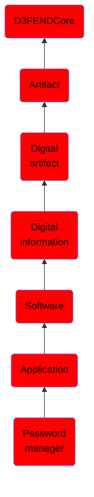

# Password manager

## Overview

### Definition
A password manager is a software application or hardware that helps a user store and organize passwords. Password managers usually store passwords encrypted, requiring the user to create a master password: a single, ideally very strong password which grants the user access to their entire password database. Some password managers store passwords on the user's computer (called offline password managers), whereas others store data in the provider's cloud (often called online password managers). However offline password managers also offer data storage in the user's own cloud accounts rather than the provider's cloud. While the core functionality of a password manager is to securely store large collections of passwords, many provide additional features such as form filling and password generation.

### Examples
Not defined.

### Aliases
Not defined.

### URI
http://d3fend.mitre.org/ontologies/d3fend.owl#PasswordManager

### Subclass Of

- [D3FENDCore](/docs/ontology/reference/model/D3FENDCore/D3FENDCore.md)
- [Artifact](/docs/ontology/reference/model/D3FENDCore/Artifact/Artifact.md)
- [Digital artifact](/docs/ontology/reference/model/D3FENDCore/Artifact/Digital%20artifact/Digital%20artifact.md)
- [Digital information](/docs/ontology/reference/model/D3FENDCore/Artifact/Digital%20artifact/Digital%20information/Digital%20information.md)
- [Software](/docs/ontology/reference/model/D3FENDCore/Artifact/Digital%20artifact/Digital%20information/Software/Software.md)
- [Application](/docs/ontology/reference/model/D3FENDCore/Artifact/Digital%20artifact/Digital%20information/Software/Application/Application.md)
- [Password manager](/docs/ontology/reference/model/D3FENDCore/Artifact/Digital%20artifact/Digital%20information/Software/Application/Password%20manager/Password%20manager.md)

### Ontology Reference
- [d3fend](http://d3fend.mitre.org/ontologies/d3fend.owl#)

## Properties
### Data Properties
| Ontology | Label | Definition | Example | Domain | Range |
|----------|-------|------------|---------|--------|-------|
| d3fend | [d3fend-artifact-data-property](http://d3fend.mitre.org/ontologies/d3fend.owl#d3fend-artifact-data-property) | x d3fend-artifact-data-property y: The artifact x has the data property y. |  | [Digital Artifact](/docs/ontology/reference/model/D3FENDCore/Artifact/Digital%20artifact/Digital%20artifact.md) |  |

### Object Properties
| Ontology | Label | Definition | Example | Domain | Range | Inverse Of |
|----------|-------|------------|---------|--------|-------|------------|
| d3fend | [may-have-weakness](http://d3fend.mitre.org/ontologies/d3fend.owl#may-have-weakness) |  |  | [Artifact](/docs/ontology/reference/model/D3FENDCore/Artifact/Artifact.md) | [Weakness](/docs/ontology/reference/model/D3FENDCore/Weakness/Weakness.md) |  |

