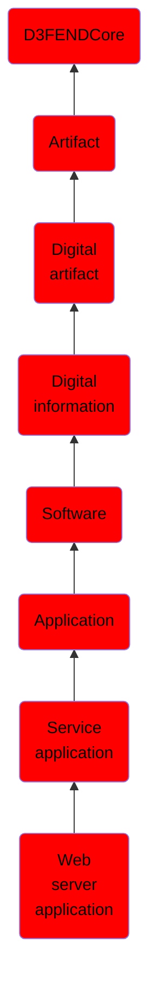

# Web server application

## Overview

### Definition
A web server application (or web app) is an application software that runs on a web server, unlike computer-based software programs that are stored locally on the Operating System (OS) of the device. Web applications are accessed by the user through a web browser with an active internet connection. These applications are programmed using a client-server modeled structure-the user ("client") is provided services through an off-site server that is hosted by a third-party. Examples of commonly-used, web applications, include: web-mail, online retail sales, online banking, and online auctions.

### Examples
Not defined.

### Aliases
- Web Application
- Web App

### URI
http://d3fend.mitre.org/ontologies/d3fend.owl#WebServerApplication

### Subclass Of

- [D3FENDCore](/docs/ontology/reference/model/D3FENDCore/D3FENDCore.md)
- [Artifact](/docs/ontology/reference/model/D3FENDCore/Artifact/Artifact.md)
- [Digital artifact](/docs/ontology/reference/model/D3FENDCore/Artifact/Digital%20artifact/Digital%20artifact.md)
- [Digital information](/docs/ontology/reference/model/D3FENDCore/Artifact/Digital%20artifact/Digital%20information/Digital%20information.md)
- [Software](/docs/ontology/reference/model/D3FENDCore/Artifact/Digital%20artifact/Digital%20information/Software/Software.md)
- [Application](/docs/ontology/reference/model/D3FENDCore/Artifact/Digital%20artifact/Digital%20information/Software/Application/Application.md)
- [Service application](/docs/ontology/reference/model/D3FENDCore/Artifact/Digital%20artifact/Digital%20information/Software/Application/Service%20application/Service%20application.md)
- [Web server application](/docs/ontology/reference/model/D3FENDCore/Artifact/Digital%20artifact/Digital%20information/Software/Application/Service%20application/Web%20server%20application/Web%20server%20application.md)

### Ontology Reference
- [d3fend](http://d3fend.mitre.org/ontologies/d3fend.owl#)

## Properties
### Data Properties
| Ontology | Label | Definition | Example | Domain | Range |
|----------|-------|------------|---------|--------|-------|
| d3fend | [d3fend-artifact-data-property](http://d3fend.mitre.org/ontologies/d3fend.owl#d3fend-artifact-data-property) | x d3fend-artifact-data-property y: The artifact x has the data property y. |  | [Digital Artifact](/docs/ontology/reference/model/D3FENDCore/Artifact/Digital%20artifact/Digital%20artifact.md) |  |

### Object Properties
| Ontology | Label | Definition | Example | Domain | Range | Inverse Of |
|----------|-------|------------|---------|--------|-------|------------|
| d3fend | [may-have-weakness](http://d3fend.mitre.org/ontologies/d3fend.owl#may-have-weakness) |  |  | [Artifact](/docs/ontology/reference/model/D3FENDCore/Artifact/Artifact.md) | [Weakness](/docs/ontology/reference/model/D3FENDCore/Weakness/Weakness.md) |  |

