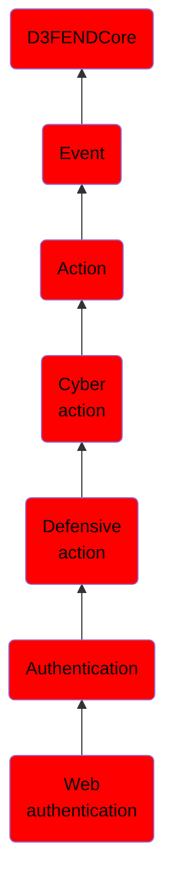

# Web authentication

## Overview

### Definition
A request-response comprising a user credential presentation to a system and a verification response where the verifying party is a web server.

### Examples
Not defined.

### Aliases
Not defined.

### URI
http://d3fend.mitre.org/ontologies/d3fend.owl#WebAuthentication

### Subclass Of

- [D3FENDCore](/docs/ontology/reference/model/D3FENDCore/D3FENDCore.md)
- [Event](/docs/ontology/reference/model/D3FENDCore/Event/Event.md)
- [Action](/docs/ontology/reference/model/D3FENDCore/Event/Action/Action.md)
- [Cyber action](/docs/ontology/reference/model/D3FENDCore/Event/Action/Cyber%20action/Cyber%20action.md)
- [Defensive action](/docs/ontology/reference/model/D3FENDCore/Event/Action/Cyber%20action/Defensive%20action/Defensive%20action.md)
- [Authentication](/docs/ontology/reference/model/D3FENDCore/Event/Action/Cyber%20action/Defensive%20action/Authentication/Authentication.md)
- [Web authentication](/docs/ontology/reference/model/D3FENDCore/Event/Action/Cyber%20action/Defensive%20action/Authentication/Web%20authentication/Web%20authentication.md)

### Ontology Reference
- [d3fend](http://d3fend.mitre.org/ontologies/d3fend.owl#)

## Properties
