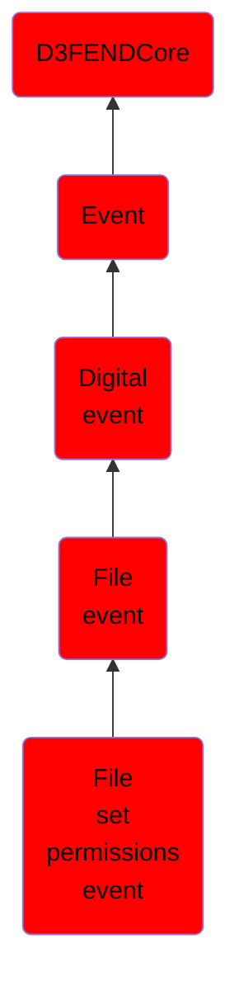

# File set permissions event

## Overview

### Definition
An event involving the modification of a file's permissions or access control list (ACL), specifying which users or processes are granted or restricted access.

### Examples
Not defined.

### Aliases
Not defined.

### URI
http://d3fend.mitre.org/ontologies/d3fend.owl#FileSetPermissionsEvent

### Subclass Of

- [D3FENDCore](/docs/ontology/reference/model/D3FENDCore/D3FENDCore.md)
- [Event](/docs/ontology/reference/model/D3FENDCore/Event/Event.md)
- [Digital event](/docs/ontology/reference/model/D3FENDCore/Event/Digital%20event/Digital%20event.md)
- [File event](/docs/ontology/reference/model/D3FENDCore/Event/Digital%20event/File%20event/File%20event.md)
- [File set permissions event](/docs/ontology/reference/model/D3FENDCore/Event/Digital%20event/File%20event/File%20set%20permissions%20event/File%20set%20permissions%20event.md)

### Ontology Reference
- [d3fend](http://d3fend.mitre.org/ontologies/d3fend.owl#)

## Properties
