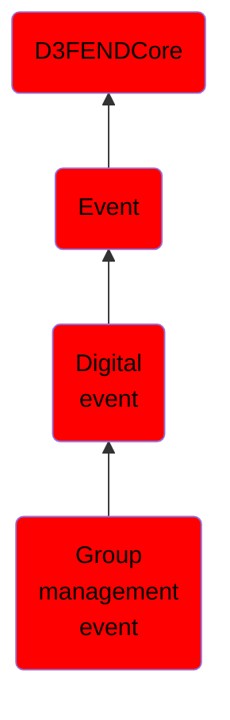

# Group management event

## Overview

### Definition
An event involving the creation, modification, or deletion of a group, or changes to its membership and privileges. Group management events facilitate the enforcement of role-based access control by organizing users and permissions into logical units for streamlined administration and policy enforcement.

### Examples
Not defined.

### Aliases
Not defined.

### URI
http://d3fend.mitre.org/ontologies/d3fend.owl#GroupManagementEvent

### Subclass Of

- [D3FENDCore](/docs/ontology/reference/model/D3FENDCore/D3FENDCore.md)
- [Event](/docs/ontology/reference/model/D3FENDCore/Event/Event.md)
- [Digital event](/docs/ontology/reference/model/D3FENDCore/Event/Digital%20event/Digital%20event.md)
- [Group management event](/docs/ontology/reference/model/D3FENDCore/Event/Digital%20event/Group%20management%20event/Group%20management%20event.md)

### Ontology Reference
- [d3fend](http://d3fend.mitre.org/ontologies/d3fend.owl#)

## Properties
